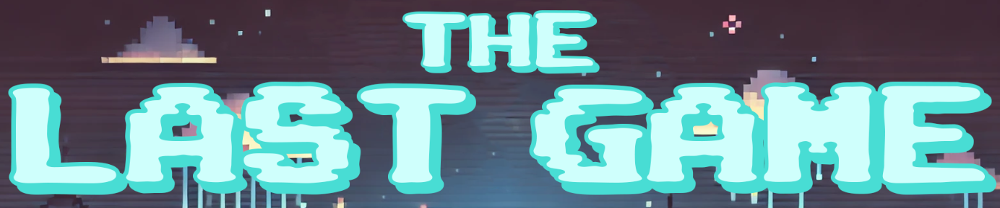

  

## About
**The Last Game** is a rogue-like dungeon crawler that is AI driven. The floor generation, enemy and weapon stats, and story are all generated by an AI. 

## Documentation
All of the documentation can be located in the [documentation](./documentation/) folder. This includes: 
- [Requirements](./documentation/Requirements.md)
- [High level design](./documentation/HighLevelDesign.md)
- [Low level design](./documentation/LowLevelDesign.md)
- [Test report](./documentation/TestDesignReport.md)
- [User manual](./documentation/UsersManual.md)

## Getting started
For running the game locally, see the [getting started](./documentation/UsersManual.md/#getting-started) section in the user manual.