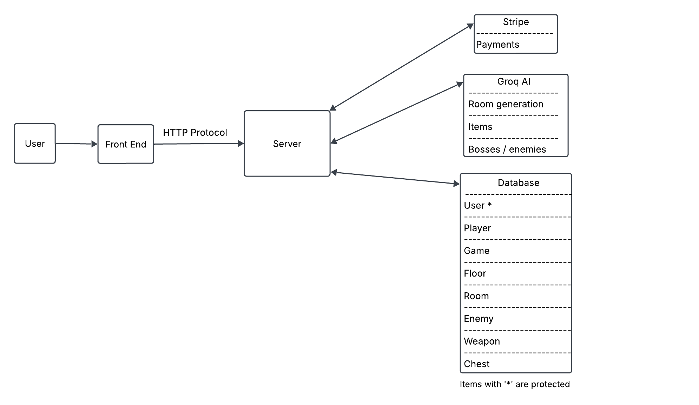

# High-Level Design Document

## Table of Contents

1. [Introduction](#1-introduction)  
2. [System Overview](#2-system-overview)  
3. [Architecture Design](#3-architecture-design)  
4. [Modules and Components (Internal Interfaces)](#4-modules-and-components-internal-interfaces)  
5. [Data Design](#5-data-design)  
6. [Integration Points (External Interfaces)](#6-integration-points-external-interfaces)  
7. [User Interface (UI) Design Overview](#7-user-interface-ui-design-overview)  
8. [Game Interface Design](#8-game-interface-design-overview)  
9. [Security and Privacy](#9-security-and-privacy)  
10. [Testing Strategy](#10-testing-strategy)  
11. [Business and Legal](#11-business-and-legal)  
12. [Interactions Diagram](#12-interactions-diagram)  

## 1. Introduction

### Purpose
This document serves as a reference for developers working on Last Game, ensuring that the development team can work independently while maintaining code compatibility.

### Scope
This document focuses on the rationale behind design choices rather than specific implementation details.

### Audience
The document is intended for developers and stakeholders to ensure alignment in development.

---

## 2. System Overview

### Problem Statement
[Describe the problem your project aims to solve.]

### Proposed Solution
[Explain the proposed solution, how it addresses the problem, and any key benefits.]

### Hardware Platform

#### Laptop/Desktop
- **Website:** [How the system will function on desktops/laptops]
- **Touchscreen Laptops:** [Considerations for touchscreen-enabled devices]

---

## 3. Architecture Design

### Architecture Overview
[Describe the chosen architecture type, such as client-server, microservices, or monolithic.]

### Component Diagram
[Provide a diagram outlining major system components and their relationships.]

### Technology Stack
- **Frontend:** [List frontend framework/language]
- **Backend:** [List backend framework/language]
- **Database:** [Database choice and rationale]
- **AI (if applicable):** [Machine learning models and their purpose]

---

## 4. Modules and Components (Internal Interfaces)

### Module Overview
[Describe the key modules/components, their responsibilities, and how they interact.]

### Data Flow Diagram (DFD)
[Illustrate how data moves between different components.]

### Component Interaction
[Explain how system components communicate, including APIs and services.]

---

## 5. Data Design

### Data Model
- **Key Entities:** [List and describe the primary entities]
- **Relationships:** [Describe entity relationships]

### Database Design
- **Database Type:** [Relational (SQL) or NoSQL]
- **Major Tables:** [Overview of the database schema]
- **Indexes & Optimization:** [Performance considerations]

### Data Access Layer
- **ORM or SQL Queries:** [Data access methods]
- **Caching & Performance Optimization:** [Strategies to optimize data access]
- **Encryption & Security:** [How sensitive data is protected]

---

## 6. Integration Points (External Interfaces)

### External Systems & APIs
* **[Groq AI](https://console.groq.com/docs/overview)**
  * Free
  * Easy to set up
  * Works well with Langchain/LangGraph
    * Allows it to have more capabilities than a normal LLM
    * Easy to add new capabilites
  * allows multiple users use it without reducing performance 
  * Faster performance than trying to run an LLM on our own hardware
    * limited to <= 1,000 requests per day or 500,000 tokens per day
    * Users are unlikely to hit the request limit even if they play for about 2-3 hours per day
  * Overview of use:
    * Server invokes python script using command line arguments
    * Script parses arguments & invokes the LLM model using the API 
    * Model calls a function to perform a goal (see [interactions diagram](#12-interactions-diagram) for possible functions)
    * Check for valid output
    * return results to server
* Stripe
  * Free
  * Easy to implement
  * Secure - uses AES-256 encryption, which is considered one of the most secure types
 
### Notifications
* Stripe - handled by API
* Groq
  * Uses API to check if the `429 Too Many Requrests` status code occured
  * Pop up to notify user they hit the rate limit

---

## 7. User Interface (UI) Design Overview

### UI/UX Principles
[Explain core UI/UX principles such as accessibility and responsiveness.]

### Mockups
[Provide high-level mockups or wireframes.]

### Navigation Flow
[Describe how users navigate through the app.]

---

## 8. Game Interface Design Overview

### UI/UX Principles

The game interface follows a simple and intuitive design to ensure players can navigate seamlessly through the game. The principles guiding the UI/UX design include:

- **Minimalist Design**: Keep the interface clean and focused on gameplay elements.
- **Ease of Navigation**: Clear menu options and intuitive controls for an uninterrupted experience.
- **Thematic Consistency**: Visuals align with the chosen dungeon theme.

### Markups

**Basic Room**

**Room with Enemies**

**Cleared Chest Room**

**Complete Sprite Sheet**

### Navigation Flow

#### **Main Menu**
Main menu will have buttons that do the following:
- "Start" - Begin a new game.
- "Load" - Resume a previously saved game.
- "Settings" - Open settings overlay to adjust in-game preferences.

#### **Game Start**
- Player selects a dungeon theme (Classic-Futuristic-Wilderness) and floor difficulty (Easy-Medium-Hard)
- AI generates a new floor using randomly-generated rooms. The tileset used will correlate with the selected theme.
- A.I. sets begins/continues story using auto-scrolling text.
- Player is placed in a starting room.

#### **Exploration and Combat**
- Player explores the floor in search of the stair room.
- A.I.-generated monsters appear in each room.
- Special rooms (chest rooms, stair rooms, trap rooms) have the chance to spawn in place of normal rooms.
- Players collect random items from chests:
  - Weapons (Random stats generated by A.I.)
  - Potions
  - XP Boost
  - Players are given the option to watch an ad to re-roll a chest once.
  - Subscription service allows custom theme creation and unlimited re-rolls.
- Combat:
  - Enemies perform actions in response to Player actions (Attack, Block, Heal, Move)
  - The Player's weapon determines damage and which enemy/enemies are in range of the attack.
    - Melee: Single target in the direction the Player is facing. Typically most single-target damage
    - Ranged: 3 tiles in the direction the Player is facing. Less damage than melee.
    - Sweep: 4 tiles in ˥ shape in the direction the Player is facing. Less damage than ranged.
    - AoE: 8 tiles immediately surrounding the player. Less damage than sweep.

#### **HUD Elements**
- Press 'Tab' to switch between primary and secondary weapons
- Press 'E' to view stats.
- Press 'Esc' to open the menu (save progress and adjust settings).

#### **Progression**
- Player finds stairs to the next floor.
- Floor generation repeats with increased difficulty.
- If the player loses all 3 lives, the game ends, and their high score is recorded.

#### **End of Game**
- If a new high score is achieved, it replaces the previous one.

### AI-Generated Floor Design

- AI will generate random rooms in a grid to form a floor
- Each floor will contain:
  - A starting room.
  - A number of standard rooms (10-16).
  - At least three chest rooms.
  - A stair room leading to the next floor.
- Enemy difficulty will scale based on the selected path (Easy, Medium, Hard).
- NPCs may appear after rooms are cleared to advance the storyline.

### Special Features

- **Dynamic Room Layouts**: Dungeon floors will be randomly, but procedurely, generated to avoid redundant gameplay.
- **Item Scaling**: Higher difficulties increase the chances of rare loot.
- **Ad-based Rewards**: Players can re-roll chests by watching ads.
- **Subscription Benefits**: Allows custom dungeon themes and unlimited chest re-rolls.

---

## 9. Security and Privacy
#### Identified Risks:

1. Weak Account Security - Since users will create accounts with a username and password, unauthorized access through compromised credentials poses a risk to gameplay integrity and financial data for subscription users.
2. Brute-Force Attacks - Attackers could attempt to guess passwords through brute-force methods, leading to unauthorized account access.
3. SQL Injection (SQLi) - Malicious users could inject SQL commands through input fields to manipulate the database.
4. AI Prompt Injection - Although users do not have direct text-based interaction with the AI, adversarial inputs could still manipulate AI-generated game content.
5. Cross-Site Scripting (XSS) - Attackers could inject malicious scripts into the browser, potentially stealing session cookies and user data.
6. Denial of Service (DoS/DDoS) Attacks - Overwhelming the game’s servers with excessive requests could render it unavailable.
7. Phishing Attacks - Fake login pages or malicious emails could trick users into giving up their credentials or payment information.
8. Insecure API Keys - Exposed or improperly managed API keys could be exploited by attackers to access backend services.

#### Mitigation Plans:
1. Weak Account Security  
    * Secure Password Storage: Use bcrypt (golang.org/x/crypto/bcrypt) to hash passwords before storing them. 
    * JWT Tokens: Authenticate users with token-based authentication (github.com/golang-jwt/jwt) to avoid sending sensitive data with each request.
2. Brute-Force Attacks 
    * Account Lockout & Rate Limiting: Implement progressive lockout after repeated failed attempts. Use rate limiting middleware (golang.org/x/time/rate). Integrate reCAPTCHA (github.com/dchest/captcha) if the team determines there is enough time to do so.
3. SQL Injection (SQLi) 
    * Prepared Statements & ORM Protection: Use GORM ORM (gorm.io/gorm) to prevent raw SQL execution. Use Go’s database/sql package with prepared statements to sanitize queries.
4. AI Prompt Injection 
    * Input Validation & AI Query Control: Sanitize all AI-generated outputs to ensure only game-relevant content is processed. Implement whitelisting of allowed user inputs for AI queries.
5. Cross-Site Scripting (XSS) 
    * CSP & Input Sanitization: Enable Content Security Policy (CSP) headers to prevent execution of inline scripts. Use Go’s html/template package to escape user input. Implement Sanitization Libraries (github.com/microcosm-cc/bluemonday).
6. Denial of Service (DoS/DDoS)
    * Rate Limiting & Web Application Firewall (WAF): Use rate limiting middleware (golang.org/x/time/rate). Deploy Cloudflare WAF or AWS WAF to mitigate large-scale attacks, probably in version 2.0 if there isn't enough time. Implement request throttling on API endpoints.
7. Phishing Attacks 
    * User Awareness & Secure Links: Implement email verification (github.com/jordan-wright/email). Enforce HSTS headers to prevent MITM attacks. Provide clear UI warnings for users about phishing risks.
8. Insecure API Keys 
    *  Secrets Management & Environment Variables: Store API keys securely in environment variables (os.Getenv()). Use Go’s crypto package to generate secure tokens. 

#### Authentication and Authorization:

Last Game will require at least a username and password for account creation. User authentication will be handled using JWT (JSON Web Token) authentication, implemented via Go’s golang-jwt/jwt package.

This approach was chosen because:

* Efficiency – Reduces server load by avoiding frequent database queries.

* Security – Stores minimal user information in the browser, reducing exposure to session hijacking.
* Scalability – Works well with distributed systems.
Each authenticated user will receive a JWT access token upon login. This token will be required for protected actions, such as saving game progress or accessing premium content. The system will implement token expiration and refresh tokens to ensure security.

Our team has considered OAuth 2.0 as a potential future implementation to eliminate the need for password-based authentication, which could enhance security. However, OAuth integration may be explored in future updates if not feasible for version 1.0.

#### Data Encryption:

To secure sensitive user data, Last Game will implement strong encryption practices using Go’s cryptographic libraries. Specifically:

* Password Hashing: All passwords will be hashed using bcrypt (golang.org/x/crypto/bcrypt) before storage. This ensures that even if the database is compromised, user passwords remain protected.
* Token Signing: JWT tokens will be signed using HMAC SHA256 to prevent tampering.
* Database Encryption: Any sensitive database fields (e.g., payment data identifiers) will be encrypted using AES-256.
Encryption will be implemented as middleware, meaning data will be automatically encrypted before being stored or transmitted.

#### Privacy and Compliance:

To comply with General Data Protection Regulation (GDPR) and other privacy laws, Last Game follows a privacy-first approach:

* Minimal Data Collection: Only a username and password will be required for account creation.
Additional data (such as payment details) will only be collected for users who opt into the subscription model.
* User Data Control: Users will be notified at registration about the data collected.
Users will have the option to delete their account at any time, removing all personal data from our systems.
* AI Interaction Privacy: Users will not have direct text input access to the AI.
The AI will only present predefined choices related to gameplay.
This eliminates the risk of AI storing or processing user-provided personal data.

For payment security, see the [Stripe](#11-businesslegal) integration in Section 11. Business and Legal.

## 10. Testing Strategy

### Unit Testing
[Describe how unit tests will be implemented.]

### Manual Testing
[Outline manual testing procedures.]

### Docker
To ensure testing remains consistent across developers, NaN has decided to use Docker for testing deployment. Docker offers a lightweight, scalable approach to application sharing that uses fewer resources then virtual machines and works on any platform or system. This approach will reduce time developers spend configuring the application to run on their particular system or framework, enabling faster testing and therefore faster deployment of updates and/or patches.

---

## 11. Business/Legal
* Stripe (Business Payments)
    * Has a flexible API that is developer friendly
    * Fully supports subscription models, which we plan to implement into Last Game
    * Available gloablly, meaning that users from multiple countries can play and pay for the subscription in the game
    * We don't expect super-high transaction volume with the game, meaning Stripe's fees shouldn't cost the company too much
    * Supported across multiple web browsers, including Chrome, Firefox, Safari, Edge, and Opera. Because Last Game is a web-based game, Stripe will integrate smoothly for any user
    * Stripe automatically encrypts sensitive data sent between parties. Because Stripe is large, well-known, and reputable, the team feels comfortable outsourcing payment security to Stripe

* Termly (All-in-One Legal compliance software)
    * Generates legal policies tailored to the needs of the business
    * Includes a cookie consent manager to help comply with consent laws like GDPR, an law that directly effects Last Game
    * Offers multiple pricing plans including a free plan for small teams
    * Posts articles and other resources to help people stay aware of laws
    * Free policy model offers more provisions for law like GDPR as opposed to other services like TermsFeed

## 12. Interactions Diagram
The diagram below represents how the components will interact with each other. The user will interact with the front end web pages which will send and recieve data from the server using HTTP protocol. The server will be able to interact with [Stripe](#11-businesslegal) to handle payments, a Python script which handles the connection to [Groq](#6-integration-points-external-interfaces), and the [database](#5-data-design). 

---

This document serves as a guide for developers and stakeholders to ensure successful project execution.