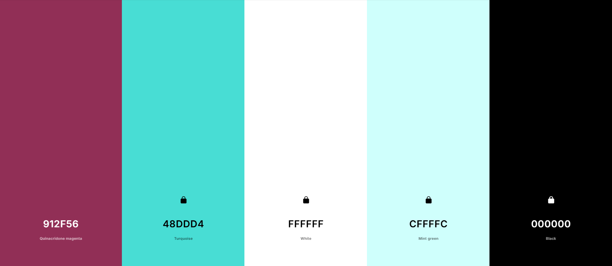
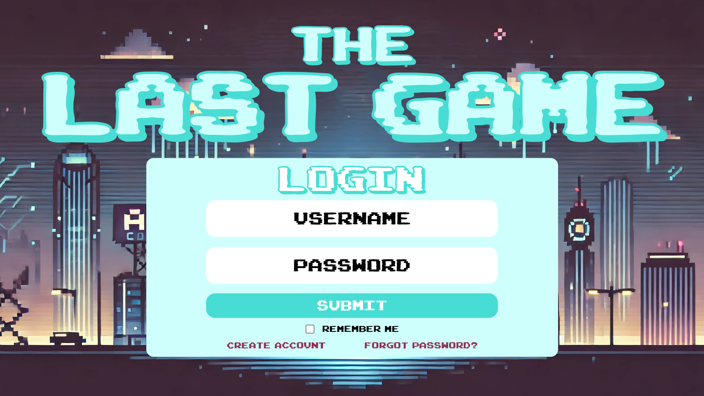
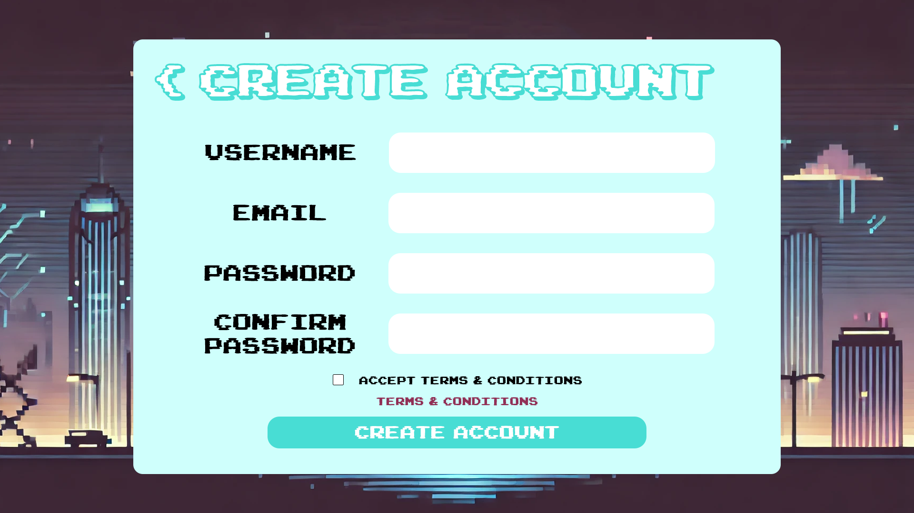
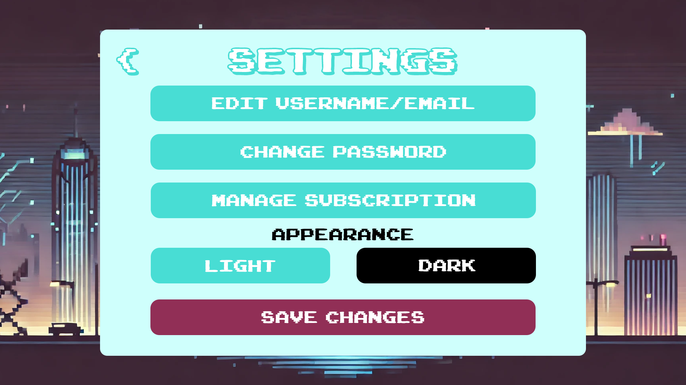
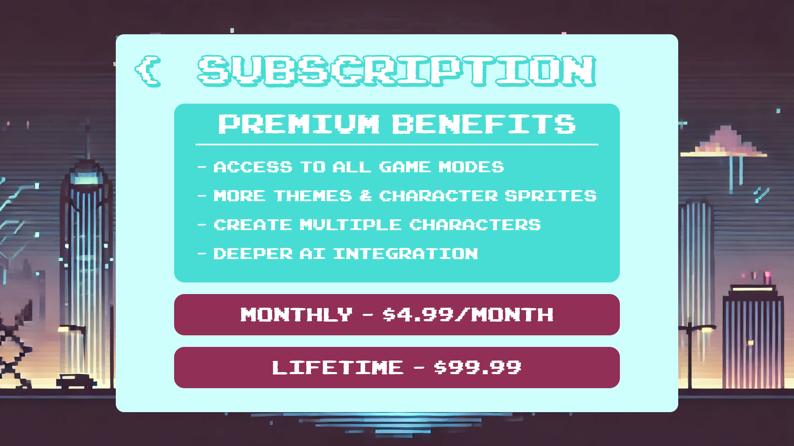
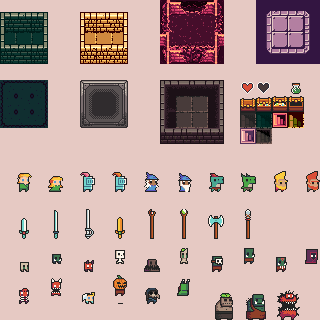
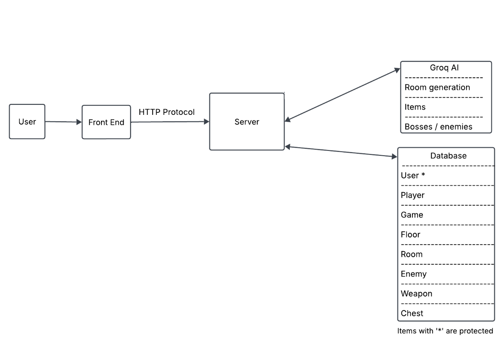

# High-Level Design Document

## Table of Contents

1. [Introduction](#1-introduction)  
2. [System Overview](#2-system-overview)  
3. [Architecture Design](#3-architecture-design)  
4. [Modules and Components (Internal Interfaces)](#4-modules-and-components-internal-interfaces)  
5. [Data Design](#5-data-design)  
6. [Integration Points (External Interfaces)](#6-integration-points-external-interfaces)  
7. [User Interface (UI) Design Overview](#7-user-interface-ui-design-overview)  
8. [Game Interface Design](#8-game-interface-design-overview)  
9. [Security and Privacy](#9-security-and-privacy)  
10. [Testing Strategy](#10-testing-strategy)  
11. [Business and Legal](#11-business-and-legal)  
12. [Interactions Diagram](#12-interactions-diagram)

---

## 1. Introduction

### Purpose

This document serves as a reference for developers working on Last Game, ensuring that the development team can work independently while maintaining code compatibility.

---

### Scope

This document focuses on the rationale behind design choices rather than specific implementation details.

---

### Audience
 
The document is intended for developers and stakeholders to ensure alignment in development.

---

## 2. System Overview

### Problem Statement

**What we planned** *(February 10, 2025)*  
Modern game development often struggles with satisfying a wide variety of audiences. Traditional games rely on pre-designed assets and scripts, limiting replayability and adaptability. Players are looking for more dynamic, personalized experiences, where AI can shape the game world, narrative, and mechanics in real time.

Additionally, designing a game that seamlessly integrates AI without disrupting the player experience poses challenges in optimization, content control, and performance consistency.

---

### Proposed Solution

**What we planned** *(February 10, 2025)*  
Our AI-driven video game leverages procedural generation and AI-controlled decision-making to create unique, dynamic gameplay experiences for each player. By incorporating advanced AI, the game will:

- Generate dynamic storylines, dungeons, and interactions based on player choices.
- Utilize AI-driven enemies that adapt to player behavior and tactics.
- Provide real-time difficulty adjustments based on player performance.
- Create AI-assisted character progression and quest development.

This approach ensures a fresh and engaging experience every time a player starts a new session, increasing replayability and engagement.

**What we did** *(April 21, 2025)*  
The minimum viable product incorporated dynamic dungeons and enemy generation driven by AI. However, due to time constraints and design changes, enemies had hard coded movement, attack patterns, and difficulty adjustments. AI-assisted character progression and quest development were scrapped for version 1.0. 

---

### Hardware Platform

---

#### Laptop/Desktop

**What we planned** *(February 10, 2025)*  
- The game will be designed primarily for **desktop and laptop systems**, with support for Windows, macOS, and Linux.
- It will run as a **web-based game** using the modern frameworks **Svelte with Phaser.js**, ensuring cross-platform compatibility.
- Players interact with the game using a **keyboard and mouse**, with a focus on **fluid UI navigation and real-time updates**.

---

## 3. Architecture Design

### Overview

**What we planned** *(February 10, 2025)*  
This project follows a **client-server architecture**. The **client** interacts with the game through a **web-based application**, which handles rendering, user input, and game mechanics. The **server** manages authentication, game state persistence, AI-generated content, and procedural logic. The **database** stores user data, game progress, and dynamically generated content.

The architecture is designed for **scalability and modularity**, ensuring that different components can be improved or replaced without affecting the overall system.

**What we did** *(April 21, 2025)*  
\ space to write updated documentation

---

### Component Diagram

**What we planned** *(February 10, 2025)*  
The following table represents the **high-level architecture** of the system, outlining the responsibilities of each component and how they interact.

#### **System Architecture Overview**

| **Component**        | **Technology**         | **Responsibilities** |
|----------------------|-----------------------|----------------------|
| **Frontend**         | Svelte + Phaser.js    | - Handles UI & game rendering  |
|                      |                       | - Manages player movement & interactions  |
|                      |                       | - Processes game logic & turn-based mechanics |
|                      |                       | - Calls API endpoints for AI generation  |
| **Backend**          | Go (Gin Framework)    | - Handles authentication & user management  |
|                      |                       | - Implements AI procedural generation  |
|                      |                       | - Provides API endpoints for game state management |
| **Database**         | PostgreSQL            | - Stores user accounts & authentication data |
|                      |                       | - Saves game progress & AI-generated content |
|                      |                       | - Manages inventory, items, and player stats |

**What we did** *(April 21, 2025)*  
\ space to write updated documentation

---

#### **Data Flow & Communication**

**What we planned** *(February 10, 2025)*  
| **Interaction**      | **Description** |
|----------------------|----------------|
| **Frontend → Backend** | Uses REST APIs to save user and game state information to the server. |
| **Backend → Database** | Queries PostgreSQL to fetch/store user progress, game state, and AI-generated content. |
| **Backend → Frontend** | Sends game updates via WebSockets and API responses for real-time feedback. |

**What we did** *(April 21, 2025)*  
\ space to write updated documentation

---

### Technology Stack & Justification

#### **Frontend:**

**What we planned** *(February 10, 2025)*  
- **Svelte**: Chosen for its lightweight and highly reactive nature. Unlike React or Vue, Svelte compiles components into highly efficient vanilla JavaScript, reducing runtime overhead and improving performance. This is beneficial for a game where responsiveness and smooth UI interactions are critical.
- **Phaser.js**: A powerful 2D game framework that integrates well with web technologies. Phaser allows us to implement animations, physics, and game logic efficiently. Its **HTML5 WebGL** support ensures smooth rendering, even in browser-based applications.

**What we did** *(April 21, 2025)*  
\ space to write updated documentation

---

#### **Backend:**

**What we planned** *(February 10, 2025)*  
- **Go (Gin Framework)**:
  - **Performance:** Go is known for its fast execution and low memory usage, making it ideal for handling game logic and player interactions efficiently.
  - **Scalability:** The Gin framework is a lightweight and high-performance HTTP framework that allows building APIs with minimal boilerplate code.
- **JWT Authentication**:
  - JSON Web Tokens (JWT) provide a **stateless** authentication mechanism, reducing server load compared to traditional session-based authentication.
  - Ensures secure user authentication for saved progress and player-specific game states.
- **Redis (for caching)**:
  - Redis can cache **frequently accessed game data**, such as procedural-generated levels, reducing repeated database queries and improving response times.
  - It can also be used for rate limiting and **session storage**, preventing abuse of AI features.

**What we did** *(April 21, 2025)*  
\ space to write updated documentation

---

#### **Database:**

**What we planned** *(February 10, 2025)*  
- **PostgreSQL**:
  - **Relational Database**: PostgreSQL’s structured schema ensures consistency and integrity in storing game state, player data, and AI-generated content.
  - **JSONB Support**: Allows storage of dynamically generated AI content (e.g., procedurally generated storylines, levels, or NPC data) in a flexible format.
  - **ACID Compliance**: Ensures game data is **reliable and durable**, preventing data corruption in case of server crashes.

**What we did** *(April 21, 2025)*  
\ space to write updated documentation

---

#### **AI & Procedural Generation:**

**What we planned** *(February 10, 2025)*  
- **Procedural Generation**:
  - **Levels, enemies, and items** will be generated dynamically using LLMs to keep the gameplay experience fresh.
  - AI-based procedural logic can create unique dungeon layouts, challenges, and randomized loot.
- **NLP (Natural Language Processing)**:
  - AI-generated dialogue and narratives will make NPC interactions more engaging.
  - Ensures **dynamic storytelling**, allowing the player's choices to influence the game world.

---

**What we did** *(April 21, 2025)*  
\ space to write updated documentation

---

### Why This Architecture?

**What we planned** *(February 10, 2025)*  
This architecture ensures:
- **Performance**: Efficient rendering with **Svelte & Phaser**, and a fast backend with **Go & Gin**.
- **Scalability**: WebSockets and Go’s concurrency model allow real-time turn-based interactions without performance issues.
- **Security**: JWT authentication and PostgreSQL’s ACID compliance ensure **secure data handling**.
- **Extensibility**: AI-driven procedural generation ensures **endless replayability** without manual content creation.
- **Cross-Platform Playability**: As a web-based game, it is accessible across different devices with no need for downloads.

---

**What we did** *(April 21, 2025)*  
\ space to write updated documentation

---

## **4. Modules and Components (Internal Interfaces)**

### **Module Overview**

The backend is responsible for handling **game logic, player interactions, authentication (OAuth), AI-generated content, and database management**. Below is a breakdown of the key modules, their responsibilities, and how they interact within the **Go (Gin) backend**.

---

#### **Key Backend Modules & Responsibilities**

**What we planned** *(February 10, 2025)*  
| **Module**             | **Technology**            | **Responsibilities** |
|------------------------|--------------------------|----------------------|
| **Authentication**     | OAuth (OAuth2), Gin, PostgreSQL | - Manages **OAuth-based login and user sessions**.   - Supports **third-party authentication providers** (Google, GitHub, etc.).   - Stores **user profiles and access tokens securely**. |
| **Game State Manager** | Go (Gin), PostgreSQL     | - Manages **player progress, stats, inventory, and world data**.   - Ensures **persistent game state** across sessions.   - Handles **save/load mechanics** in **PostgreSQL**. |
| **AI Integration**     | Python (LangChain, Groq API) | - Sends **requests to the AI agent** for procedural generation and dynamic content.   - Retrieves **AI-generated NPC behaviors, enemy strategies, and dialogue**.   - Uses **Command line to communicate with the AI agent** |
| **Procedural Generation** | Python (via AI Agent)  | - Uses AI to generate **dynamic world elements, enemies, and items**.   - Adjusts world interactions dynamically based on **player actions**. |
| **Logging & Analytics** | Go (Gin), PostgreSQL, Redis | - Tracks **player actions, combat events, and AI interactions**.   - Uses **Redis for caching frequently accessed data**.   - Stores analytical data in **PostgreSQL** for game balancing. |
| **API Gateway**        | Go (Gin)                 | - Exposes **REST API endpoints** for the frontend.   - Manages **request routing between game modules and AI integration**.   - Handles **rate-limiting and error management**. |

---

**What we did** *(April 21, 2025)*  
\ space to write updated documentation

---

### **Component Interaction**

#### **1. Authentication Flow (OAuth)**

**What we planned** *(February 10, 2025)*  
1. The user initiates **OAuth login** or Login via the frontend.
2. The frontend redirects to the **OAuth provider (Google, GitHub, etc.)** or creates account.
3. The provider **authenticates the user and returns an access token**.
4. The backend verifies the **token**, retrieves user details, and creates a **session**.
5. The user is now authenticated, and the token is used for **subsequent API requests**.

**What we did** *(April 21, 2025)*  
\ space to write updated documentation

---

#### **2. AI Integration Flow**

**What we planned** *(February 10, 2025)*  
1. The backend **requests AI-generated content** (e.g., enemy behaviors, NPC dialogue).
2. The **Python-based AI agent (Ollama + Groq API)** processes the request.
3. The **AI-generated response** is returned to the backend, which updates the game world accordingly.

**What we did** *(April 21, 2025)*  
\ space to write updated documentation

---

#### **3. Procedural Content Flow**

**What we planned** *(February 10, 2025)*  
1. The backend requests **procedural world generation** from the AI.
2. The AI agent **creates and returns world layouts, NPCs, and items**.
3. The backend **stores and serves** this content as needed.

**What we did** *(April 21, 2025)*  
\ space to write updated documentation

---

## 5. Data Design

## Data Model

## **Key Entities:**

### User: A User model is a representation of a person who has an account and uses the game. This model will store the needed information to distinguish Users from eachother and keep data separated.

**What we planned** *(February 10, 2025)*  
* **userId**:(primary key) Identification for users
* **username**: name to identify user
* **email**: email for user
* **password**: password for user
* **players**: list of different players
* **subscriptionLevel**: represents the subscription level of the user

**What we did** *(April 21, 2025)*  
\ space to write updated documentation

---

### Player: A Player model is a representation of the character the User model will play as in the game. This players design will be based off of different information the AI gathers to create the Player specifically for the User.

**What we planned** *(February 10, 2025)*  
* **userId**: foreign key to a user
* **playerId**:(primary key) Identification for a player
* **health**: health level for user
* **inventory**: inventory object
* **game**: foreign key to a game
* **primaryWeapon**: foreign key to a weapon
* **secondaryWeapon**: foreign key to a weapon

**What we did** *(April 21, 2025)*  
\ space to write updated documentation

---

### Game: A Game model will contain all the necessary data for objects, levels, objectives, and so forth for the Player.

**What we planned** *(February 10, 2025)*  
* **gameId**: identification for a game
* **level**: Level the user is on
* **map**: foreign key to a Map for the player to traverse
* **playerSpecifications**: specified details from the User for the gameplay
* **mainEnemies**: list of main enemies/bosses that need to be defeated during the level

**What we did** *(April 21, 2025)*  
\ space to write updated documentation

---

### Floor: A Floor model contains all the needed rooms and details about how the layout of the game should look.

**What we planned** *(February 10, 2025)*  
* **mapid**: identification for the map
* **rooms**: list of different rooms to traverse

**What we did** *(April 21, 2025)*  
\ space to write updated documentation

---

### Room: A Room model contains all the needed values for rooms including enemies, chests, and adjacent rooms.

**What we planned** *(February 10, 2025)*  
* **roomid**: identification for a room
* **enemies**: foreign key to enemies that are in the room
* **chests**: foreign key to any chests that are in the room
* **adjacentRooms**: rooms you can enter from the current room

**What we did** *(April 21, 2025)*  
\ space to write updated documentation

---

### Enemy: An Enemy model will represent the attack power, abilities, and health of different adversaries in the game. This will most-likely be an abstract class that different types of enemies inherit from. This will allow us to take advantage of polymorphism within our code.

**What we planned** *(February 10, 2025)*  
* **enemyid**:(primary key) an identification for an enemy
* **attackLevel**: amount of damage dealt per attack
* **attackFrequency**: how often the enemy attacks
* **health**: the health of the enemy

**What we did** *(April 21, 2025)*  
\ space to write updated documentation

---

### Weapon: A Weapon model will represent the weapons/items that a Player can utilize to attack enemies. Weapons can be different objects (sword, potion, etc)so this will be an abstract class.

**What we planned** *(February 10, 2025)*  
* **weaponId**: an identification for a weapon
* **attackDamage**: amount of damage dealt on attack
* **health**: the amount of usage a weapon has

**What we did** *(April 21, 2025)*  
\ space to write updated documentation

---

### Chest: A Chest model will represent an object that is contained in different rooms that allow Players to pick up items.

**What we planned** *(February 10, 2025)*  
* **chestId**: identification for a chest
* **weapon**: A Weapon obejct the chest contains

**What we did** *(April 21, 2025)*  
\ space to write updated documentation

---

## **Relationships:** 

**What we planned** *(February 10, 2025)*  
* **User** to **Player**: One-to-Many
* **Player** to **Game**: One-to-One
* **Player** to **Weapon**: One-to-One (Each player will be able to have one primary weapona and one secondary weapon at a time)
* **Game** to **Floor**: One-to-One 
* **Game** to **Enemy**: One-to-Many (The Game may have multiple boss enemies)
* **Floor** to **Room**: One-to-Many (Each Floor will have multiple rooms)
* **Room**  to **Chest**: One-to-Many (Each Room may contain multiple Chests)
* **Room** to **Enemies**: One-to-Many (Each Room may contain multiple Enemies)

**What we did** *(April 21, 2025)*  
\ space to write updated documentation

---

## Database Design

**What we planned** *(February 10, 2025)*  
* We are going to use a postgresql which is a relational database. Utilizing a relational database will help us to keep our data organized, and allow us to perform any complex queries with speed and efficiency.

**What we did** *(April 21, 2025)*  
\ space to write updated documentation

---

## **Database Type:** 

**What we planned** *(February 10, 2025)*  
* We are going to be using a relational database since most of our data is all going to be related through things such as foreign keys, manytomany fields, etc.
* Our database will focus on integrity and complex, relational queries which will be beneficial for tracking things such as player, room, floors, rooms traversed, etc.

**What we did** *(April 21, 2025)*  
\ space to write updated documentation

---

## **Major Tables:**

### Users Table

**What we planned** *(February 10, 2025)*  
* **Table purpose:** Stores account details for each user.
* **Columns:** `userId | username | email | password | subscriptionLevel`

**What we did** *(April 21, 2025)*  
\ space to write updated documentation

---

### Players Table

**What we planned** *(February 10, 2025)*  
* **Table purpose:** Represents a character controlled by a user.
* **Columns:** `playerId | userId | health | primaryWeapon | secondaryWeapon | gameId`

**What we did** *(April 21, 2025)*  
\ space to write updated documentation

---

### Games Table

**What we planned** *(February 10, 2025)*  
* **Table purpose:** Stores details about the game session.
* **Columns:** `gameId | level | floorId | playerSpecifications`

**What we did** *(April 21, 2025)*  
\ space to write updated documentation

---

### Floors Table

**What we planned** *(February 10, 2025)*  
* **Table purpose:** Stores information about different game maps.
* **Columns:** `floorId | rooms`

**What we did** *(April 21, 2025)*  
\ space to write updated documentation

---

### Enemies Table

**What we planned** *(February 10, 2025)*  
* **Table purpose:** Stores information about in-game enemies.
* **Columns:** `enemyId | attackLevel | attackFrequency | health`

**What we did** *(April 21, 2025)*  
\ space to write updated documentation

---

### Rooms Table

**What we planned** *(February 10, 2025)*  
* **Table purpose:** Stores a room's details.
* **Columns:** `roomId | enemies | chests | adjacentFloors`

**What we did** *(April 21, 2025)*  
\ space to write updated documentation

---

### Weapon Table

**What we planned** *(February 10, 2025)*  
* **Table purpose:** Stores weapon details.
* **Columns:** `weaponId | health | attackDamage`

**What we did** *(April 21, 2025)*  
\ space to write updated documentation

---

### Chest Table 

**What we planned** *(February 10, 2025)*  
* **Table purpose:** Represents a one-to-many relationship between rooms and chests.
* **Columns:** `roomId | chestId | weaponId`

**What we did** *(April 21, 2025)*  
\ space to write updated documentation

---

## **Indexes & Optimization:** 

**What we planned** *(February 10, 2025)*  
* Indexes will be placed on enemies, players, and weapons on their id's since data from them will be needed and changed a lot. Such as an enemies level of a attack or health, and same with that of a player as well. Weapons, will need to be retrieved often depending on how much the player chooses to activate them or not. Details on health of an weapon and other details such as attack damage, for certain weapons, will be changed frequently during use.

**What we did** *(April 21, 2025)*  
\ space to write updated documentation

---

## Data Access Layer

**What we planned** *(February 10, 2025)*  
* We are going to use an ORM called GORM which is an ORM for GO, that is compatable with GO GIN and Postgres. This will allow us the ease of avoiding a lot of the low-level work and creating an easier syntax for us to work with for communication with the database. That all involves queries, creating, and deletion of tables and much more.
* GORM has a built in migration system, that will save us time with that work. 
* The objects are based on Go structs which can cause an ease of utilizing OOP, since GO doesn't have traditional classes as many other languages do.

**What we did** *(April 21, 2025)*  
\ space to write updated documentation

---

## **Caching & Performance Optimization:** 

**What we planned** *(February 10, 2025)*  
* We can cache the current room (including weapons, enemies) and the rooms withing 1 to 2 layers away can be easily accessed and won't cause major queries to the database each time a player goes to a new room.

**What we did** *(April 21, 2025)*  
\ space to write updated documentation

---

## **Encryption & Security:** 

**What we planned** *(February 10, 2025)*  
* We will be hashing the passwords of users before storing them into the database.
* We will also be encrypting the users emails to keep that piece of their information secure as well.

**What we did** *(April 21, 2025)*  
\ space to write updated documentation

---

## 6. Integration Points (External Interfaces)

### External Systems & APIs

**What we planned** *(February 10, 2025)*  
* **[Groq AI](https://console.groq.com/docs/overview)**
  * Free
  * Easy to set up
  * Works well with Langchain/LangGraph
    * Allows it to have more capabilities than a normal LLM
    * Easy to add new capabilites
  * allows multiple users use it without reducing performance 
  * Faster performance than trying to run an LLM on our own hardware
    * limited to <= 1,000 requests per day or 500,000 tokens per day
    * Users are unlikely to hit the request limit even if they play for about 2-3 hours per day
  * Overview of use:
    * Server invokes python script using command line arguments
    * Script parses arguments & invokes the LLM model using the API 
    * Model calls a function to perform a goal (see [interactions diagram](#12-interactions-diagram) for possible functions)
    * Check for valid output
    * return results to server

**What we did** *(April 21, 2025)*  
\ space to write updated documentation

---

## 7. User Interface (UI) Design Overview

### UI/UX Principles
 
Our game follows key UI/UX design principles to ensure an engaging and accessible experience:

- **Consistency & Simplicity** – The UI follows intuitive design patterns, minimizing learning curves.
- **Accessibility** – High-contrast colors, scalable fonts, and customizable controls enhance usability.
- **Responsiveness** – UI components will adjust dynamically to different screen sizes and resolutions.
- **Minimalist Approach** – UI elements remain unobtrusive to keep players immersed in gameplay.
- **Intuitive Navigation** – Menus and HUD elements are designed to provide quick, clear access to important features.

---

### Style Guide

#### Color Pallet

**What we planned** *(February 10, 2025)*  
- This color pallet has been tested in a color blindness simulator to ensure all UI elements are distinct enough for useability.
- **Hex Values**
    - 912f56
    - 48ddd4
    - ffffff
    - cffffc
    - 000000

**What we did** *(April 21, 2025)*  
\ space to write updated documentation

---

### Mockups

**What we planned** *(February 10, 2025)*  

**What we did** *(April 21, 2025)*  
\ space to write updated documentation

---

### Navigation Flow

#### Login Page:

**What we planned** *(February 10, 2025)*  
1. User visits website.
2. Inputs username and password.
3. Optional: Checks "Remember Me" for persistent login.
4. Clicks "Submit" button.
5. **If credentials are valid:**
   - User is redirected to the dashboard or home page.
6. **If credentials are invalid:**
   - Error message is displayed.
   - User can retry login.
7. **If user forgot password:**
   - Clicks "Forgot Password?" link.
   - Redirected to password reset page.
   - Inputs email for password recovery.
   - Receives email with reset link.
8. User can also click "Create Account" to go to the signup page.

**What we did** *(April 21, 2025)*  
\ space to write updated documentation

---

#### Create Account Page:

**What we planned** *(February 10, 2025)*  
1. User navigates to the Create Account page.
2. Inputs required details:
   - Username
   - Email
   - Password (must meet complexity requirements)
   - Confirm Password
3. Accepts Terms and Conditions (Checkbox required to proceed).
4. Clicks "Create Account" button.
5. **If registration is successful:**
   - Confirmation message is displayed.
   - User receives a verification email.
   - User is redirected to a login page after successful verification.
6. **If registration fails:**
   - Error message is displayed (e.g., email already in use, password too weak).
   - User can correct the issues and retry.
7. Option to go back to Login page via a back button.

**What we did** *(April 21, 2025)*  
\ space to write updated documentation

---

#### Settings Page:

**What we planned** *(February 10, 2025)*  
1. User accesses settings from the navigation menu.
2. User updates desired settings:
   - Edits username or email.
   - Changes password (requires old password confirmation).
   - Manage premium subscription.
   - Switches between light and dark mode.
3. Clicks "Save Changes" button.
4. **If updates are successful:**
   - Confirmation message is displayed.
5. **If updates fail:**
   - Error message is displayed.
   - User can retry saving changes.
6. User can navigate away or return to the dashboard.

**What we did** *(April 21, 2025)*  
\ space to write updated documentation

---

#### Subscription Page:

**What we planned** *(February 10, 2025)*  
1. User navigates to the subscription page.
2. Sees available subscription plans:
   - **Monthly ($4.99/month)**
   - **Lifetime ($99.99)**
3. Selects either "Monthly" or "Lifetime" subscription plan.
4. Redirected to a Stripe payment page:
   - Inputs payment details.
   - Confirms billing information.
   - Clicks "Subscribe" button.
5. **If payment is successful:**
   - Confirmation message is displayed.
   - User gains access to premium features.
6. **If payment fails:**
   - Error message is displayed.
   - User can retry payment.
7. User can cancel or change subscription anytime in account settings.

**What we did** *(April 21, 2025)*  
\ space to write updated documentation

---

## 8. Game Interface Design Overview

### UI/UX Principles

**What we planned** *(February 10, 2025)*  
The game interface follows a simple and intuitive design to ensure players can navigate seamlessly through the game. The principles guiding the UI/UX design include:

- **Minimalist Design**: Keep the interface clean and focused on gameplay elements.
- **Ease of Navigation**: Clear menu options and intuitive controls for an uninterrupted experience.
- **Thematic Consistency**: Visuals align with the chosen dungeon theme.

**What we did** *(April 21, 2025)*  
\ space to write updated documentation

---

### Markups

**What we planned** *(February 10, 2025)*  
**Basic Room**

**Room with Enemies**

**Cleared Chest Room**

**Complete Sprite Sheet**

**What we did** *(April 21, 2025)*  
\ space to write updated documentation

---

### Navigation Flow

#### **Main Menu**

**What we planned** *(February 10, 2025)*  
Main menu will have buttons that do the following:
- "Start" - Begin a new game.
- "Load" - Resume a previously saved game.
- "Settings" - Open settings overlay to adjust in-game preferences.

**What we did** *(April 21, 2025)*  
\ space to write updated documentation

---

#### **Game Start**

**What we planned** *(February 10, 2025)*  
- Player selects a dungeon theme (Classic-Futuristic-Wilderness) and floor difficulty (Easy-Medium-Hard)
- AI generates a new floor using randomly-generated rooms. The tileset used will correlate with the selected theme.
- A.I. sets begins/continues story using auto-scrolling text.
- Player is placed in a starting room.

**What we did** *(April 21, 2025)*  
\ space to write updated documentation

---

#### **Exploration and Combat**

**What we planned** *(February 10, 2025)*  
- Player explores the floor in search of the stair room.
- A.I.-generated monsters appear in each room.
- Special rooms (chest rooms, stair rooms, trap rooms) have the chance to spawn in place of normal rooms.
- Players collect random items from chests:
  - Weapons (Random stats generated by A.I.)
  - Potions
  - XP Boost
  - Players are given the option to watch an ad to re-roll a chest once.
  - Subscription service allows custom theme creation and unlimited re-rolls.
- Combat:
  - Enemies perform actions in response to Player actions (Attack, Block, Heal, Move)
  - The Player's weapon determines damage and which enemy/enemies are in range of the attack.
    - Melee: Single target in the direction the Player is facing. Typically most single-target damage
    - Ranged: 3 tiles in the direction the Player is facing. Less damage than melee.
    - Sweep: 4 tiles in ˥ shape in the direction the Player is facing. Less damage than ranged.
    - AoE: 8 tiles immediately surrounding the player. Less damage than sweep.

**What we did** *(April 21, 2025)*  
\ space to write updated documentation

---

#### **HUD Elements**

**What we planned** *(February 10, 2025)*  
- Press 'Tab' to switch between primary and secondary weapons
- Press 'E' to view stats.
- Press 'Esc' to open the menu (save progress and adjust settings).

**What we did** *(April 21, 2025)*  
\ space to write updated documentation

---

#### **Progression**

**What we planned** *(February 10, 2025)*  
- Player finds stairs to the next floor.
- Floor generation repeats with increased difficulty.
- If the player loses all 3 lives, the game ends, and their high score is recorded.

**What we did** *(April 21, 2025)*  
\ space to write updated documentation

---

#### **End of Game**

**What we planned** *(February 10, 2025)*  
- If a new high score is achieved, it replaces the previous one.

**What we did** *(April 21, 2025)*  
\ space to write updated documentation

---

### AI-Generated Floor Design

**What we planned** *(February 10, 2025)*  
- AI will generate random rooms in a grid to form a floor
- Each floor will contain:
  - A starting room.
  - A number of standard rooms (10-16).
  - At least three chest rooms.
  - A stair room leading to the next floor.
- Enemy difficulty will scale based on the selected path (Easy, Medium, Hard).
- NPCs may appear after rooms are cleared to advance the storyline.

**What we did** *(April 21, 2025)*  
\ space to write updated documentation

---

### Special Features

**What we planned** *(February 10, 2025)*  
- **Dynamic Room Layouts**: Dungeon floors will be randomly, but procedurely, generated to avoid redundant gameplay.
- **Item Scaling**: Higher difficulties increase the chances of rare loot.
- **Ad-based Rewards**: Players can re-roll chests by watching ads.
- **Subscription Benefits**: Allows custom dungeon themes and unlimited chest re-rolls.

**What we did** *(April 21, 2025)*  
\ space to write updated documentation

---

## 9. Security and Privacy

#### Identified Risks:

**What we planned** *(February 10, 2025)*  
1. Weak Account Security - Since users will create accounts with a username and password, unauthorized access through compromised credentials poses a risk to gameplay integrity and financial data for subscription users.
2. Brute-Force Attacks - Attackers could attempt to guess passwords through brute-force methods, leading to unauthorized account access.
3. SQL Injection (SQLi) - Malicious users could inject SQL commands through input fields to manipulate the database.
4. AI Prompt Injection - Although users do not have direct text-based interaction with the AI, adversarial inputs could still manipulate AI-generated game content.
5. Cross-Site Scripting (XSS) - Attackers could inject malicious scripts into the browser, potentially stealing session cookies and user data.
6. Denial of Service (DoS/DDoS) Attacks - Overwhelming the game’s servers with excessive requests could render it unavailable.
7. Phishing Attacks - Fake login pages or malicious emails could trick users into giving up their credentials or payment information.
8. Insecure API Keys - Exposed or improperly managed API keys could be exploited by attackers to access backend services.

**What we did** *(April 21, 2025)*  
\ space to write updated documentation

---

#### Mitigation Plans:

**What we planned** *(February 10, 2025)*  
1. Weak Account Security  
    * Secure Password Storage: Use bcrypt (golang.org/x/crypto/bcrypt) to hash passwords before storing them. 
    * JWT Tokens: Authenticate users with token-based authentication (github.com/golang-jwt/jwt) to avoid sending sensitive data with each request.
2. Brute-Force Attacks 
    * Account Lockout & Rate Limiting: Implement progressive lockout after repeated failed attempts. Use rate limiting middleware (golang.org/x/time/rate). Integrate reCAPTCHA (github.com/dchest/captcha) if the team determines there is enough time to do so.
3. SQL Injection (SQLi) 
    * Prepared Statements & ORM Protection: Use GORM ORM (gorm.io/gorm) to prevent raw SQL execution. Use Go’s database/sql package with prepared statements to sanitize queries.
4. AI Prompt Injection 
    * Input Validation & AI Query Control: Sanitize all AI-generated outputs to ensure only game-relevant content is processed. Implement whitelisting of allowed user inputs for AI queries.
5. Cross-Site Scripting (XSS) 
    * CSP & Input Sanitization: Enable Content Security Policy (CSP) headers to prevent execution of inline scripts. Use Go’s html/template package to escape user input. Implement Sanitization Libraries (github.com/microcosm-cc/bluemonday).
6. Denial of Service (DoS/DDoS)
    * Rate Limiting & Web Application Firewall (WAF): Use rate limiting middleware (golang.org/x/time/rate). Deploy Cloudflare WAF or AWS WAF to mitigate large-scale attacks, probably in version 2.0 if there isn't enough time. Implement request throttling on API endpoints.
7. Phishing Attacks 
    * User Awareness & Secure Links: Implement email verification (github.com/jordan-wright/email). Enforce HSTS headers to prevent MITM attacks. Provide clear UI warnings for users about phishing risks.
8. Insecure API Keys 
    *  Secrets Management & Environment Variables: Store API keys securely in environment variables (os.Getenv()). Use Go’s crypto package to generate secure tokens.

**What we did** *(April 21, 2025)*  
\ space to write updated documentation

---

#### Authentication and Authorization:

**What we planned** *(February 10, 2025)*  
Last Game will require at least a username and password for account creation. User authentication will be handled using JWT (JSON Web Token) authentication, implemented via Go’s golang-jwt/jwt package.

This approach was chosen because:

* Efficiency – Reduces server load by avoiding frequent database queries.
* Security – Stores minimal user information in the browser, reducing exposure to session hijacking.
* Scalability – Works well with distributed systems.
Each authenticated user will receive a JWT access token upon login. This token will be required for protected actions, such as saving game progress or accessing premium content. The system will implement token expiration and refresh tokens to ensure security.

Our team has considered OAuth 2.0 as a potential future implementation to eliminate the need for password-based authentication, which could enhance security. However, OAuth integration may be explored in future updates if not feasible for version 1.0.

**What we did** *(April 21, 2025)*  
\ space to write updated documentation

---

#### Data Encryption:

**What we planned** *(February 10, 2025)*  
To secure sensitive user data, Last Game will implement strong encryption practices using Go’s cryptographic libraries. Specifically:

* Password Hashing: All passwords will be hashed using bcrypt (golang.org/x/crypto/bcrypt) before storage. This ensures that even if the database is compromised, user passwords remain protected.
* Token Signing: JWT tokens will be signed using HMAC SHA256 to prevent tampering.
* Database Encryption: Any sensitive database fields (e.g., payment data identifiers) will be encrypted using AES-256.
Encryption will be implemented as middleware, meaning data will be automatically encrypted before being stored or transmitted.

**What we did** *(April 21, 2025)*  
\ space to write updated documentation

---

#### Privacy and Compliance:

**What we planned** *(February 10, 2025)*  
To comply with General Data Protection Regulation (GDPR) and other privacy laws, Last Game follows a privacy-first approach:

* Minimal Data Collection: Only a username and password will be required for account creation.
Additional data (such as payment details) will only be collected for users who opt into the subscription model.
* User Data Control: Users will be notified at registration about the data collected.
Users will have the option to delete their account at any time, removing all personal data from our systems.
* AI Interaction Privacy: Users will not have direct text input access to the AI.
The AI will only present predefined choices related to gameplay.
This eliminates the risk of AI storing or processing user-provided personal data.

For payment security, see the [Stripe](#11-businesslegal) integration in Section 11. Business and Legal.

**What we did** *(April 21, 2025)*  
\ space to write updated documentation

---

## 10. Testing Strategy

### Unit Testing

**What we planned** *(February 10, 2025)*  
* For every implemented function, class, or method created, a unit test should be created as well. The unit tests must included test cases that cover all possible actions and grounds that a user could cover.
* For the frontend, Vitest will be utilized to create unit tests for the code that involves TypeScript and Svelte.
* For the backend, the tests will be created utilizing GO's built in 'testing' package.
* Gitlab CI/CD will be utilized and added to as more and more unit tests are created and added to the program. Pull requests must pass all previously created unit tests that have been added to the CI/CD pipeline before being merged into the main branch.

**What we did** *(April 21, 2025)*  
\ space to write updated documentation

---

### Manual Testing

**What we planned** *(February 10, 2025)*  
* For new functions and capabilities added to the program, a list of instructions to execute the function must be given. Those instructions then must be followed and executed by another member of the development team before the pull request can be merged into the main branch.
* Once a pull request has been merged, the same manual testing must be performed on the main branch to gaurantee proper functionality.
* During early stages of development, most of the functionality should be tested manually even after other pull requests have been merged.

**What we did** *(April 21, 2025)*  
\ space to write updated documentation

---

### Docker

**What we planned** *(February 10, 2025)*  
To ensure testing remains consistent across developers, NaN has decided to use Docker for testing deployment. Docker offers a lightweight, scalable approach to application sharing that uses fewer resources then virtual machines and works on any platform or system. This approach will reduce time developers spend configuring the application to run on their particular system or framework, enabling faster testing and therefore faster deployment of updates and/or patches.

---

**What we did** *(April 21, 2025)*  
\ space to write updated documentation

---

## 11. Business/Legal

**What we planned** *(February 10, 2025)*  
* Stripe (Business Payments)
    * Has a flexible API that is developer friendly
    * Fully supports subscription models, which we plan to implement into Last Game
    * Available gloablly, meaning that users from multiple countries can play and pay for the subscription in the game
    * We don't expect super-high transaction volume with the game, meaning Stripe's fees shouldn't cost the company too much
    * Supported across multiple web browsers, including Chrome, Firefox, Safari, Edge, and Opera. Because Last Game is a web-based game, Stripe will integrate smoothly for any user
    * Stripe automatically encrypts sensitive data sent between parties. Because Stripe is large, well-known, and reputable, the team feels comfortable outsourcing payment security to Stripe

* Termly (All-in-One Legal compliance software)
    * Generates legal policies tailored to the needs of the business
    * Includes a cookie consent manager to help comply with consent laws like GDPR, an law that directly effects Last Game
    * Offers multiple pricing plans including a free plan for small teams
    * Posts articles and other resources to help people stay aware of laws
    * Free policy model offers more provisions for law like GDPR as opposed to other services like TermsFeed

**What we did** *(April 21, 2025)*  
\ space to write updated documentation

---

## 12. Interactions Diagram

**What we planned** *(February 10, 2025)*  
The diagram below represents how the components will interact with each other. The user will interact with the front end web pages which will send and recieve data from the server using HTTP protocol. a Python script which handles the connection to [Groq](#6-integration-points-external-interfaces) and the [database](#5-data-design). 

---

This document serves as a guide for developers and stakeholders to ensure successful project execution.

**What we did** *(April 21, 2025)*  
\ space to write updated documentation

---

