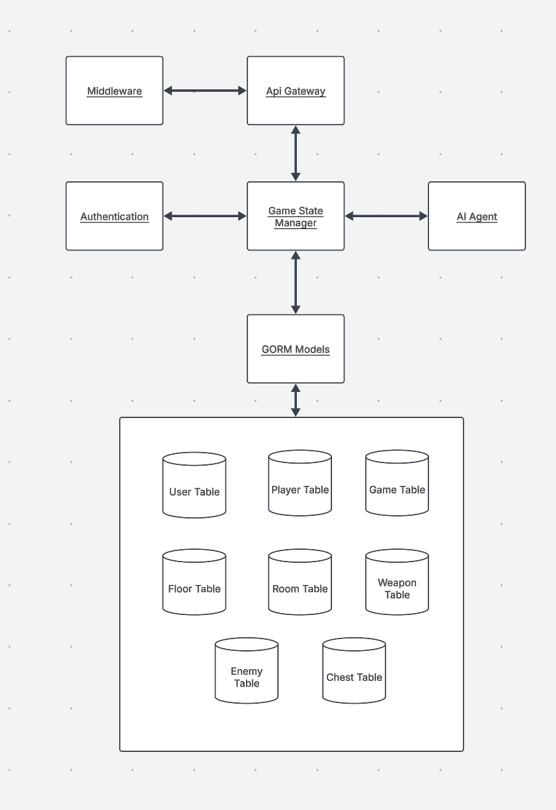
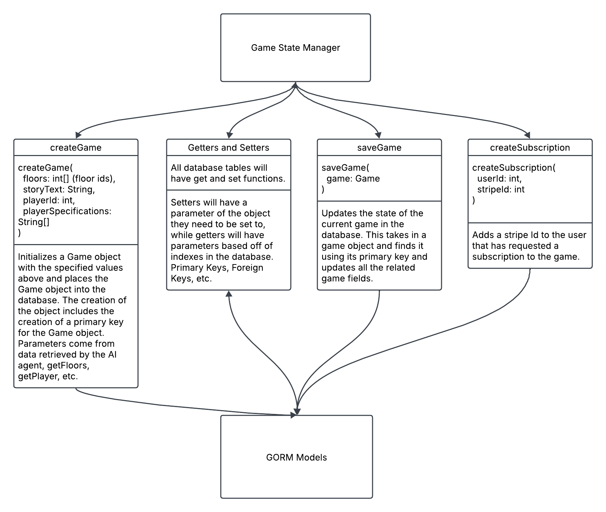
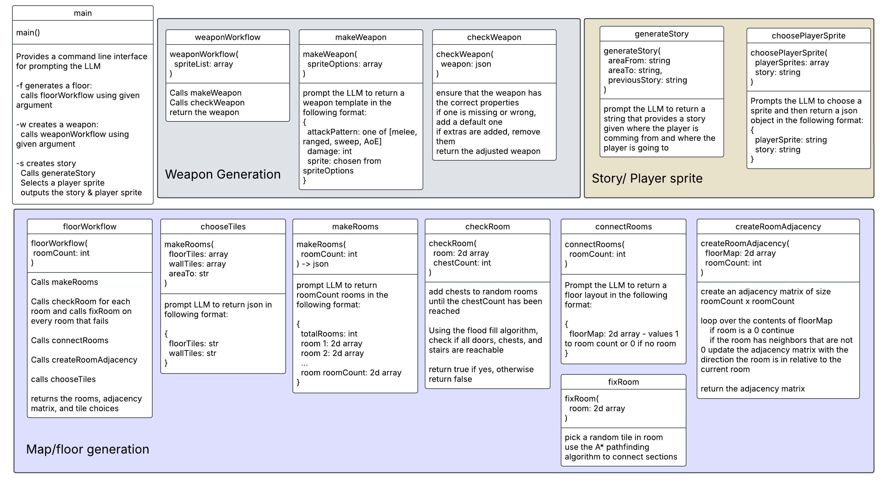
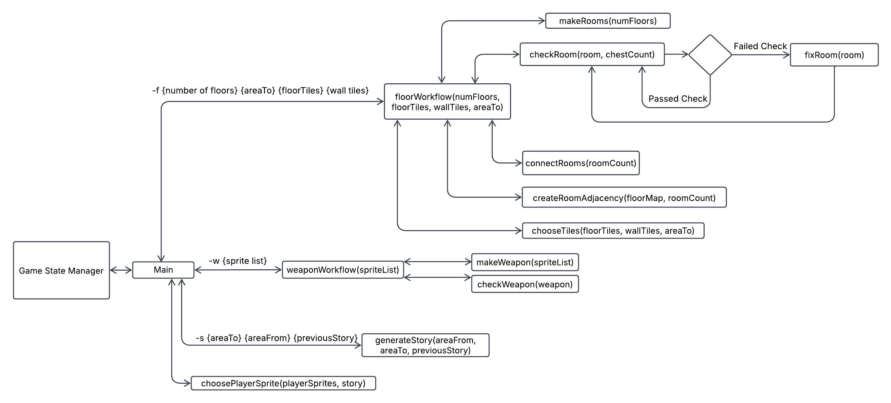
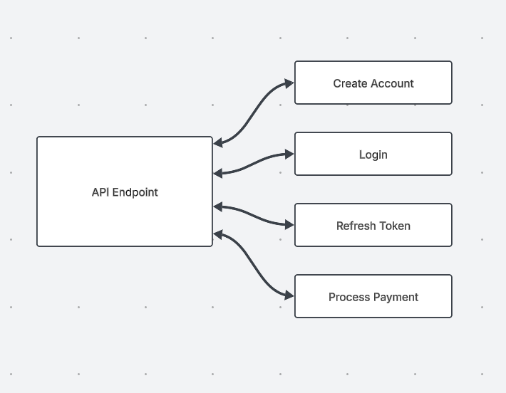
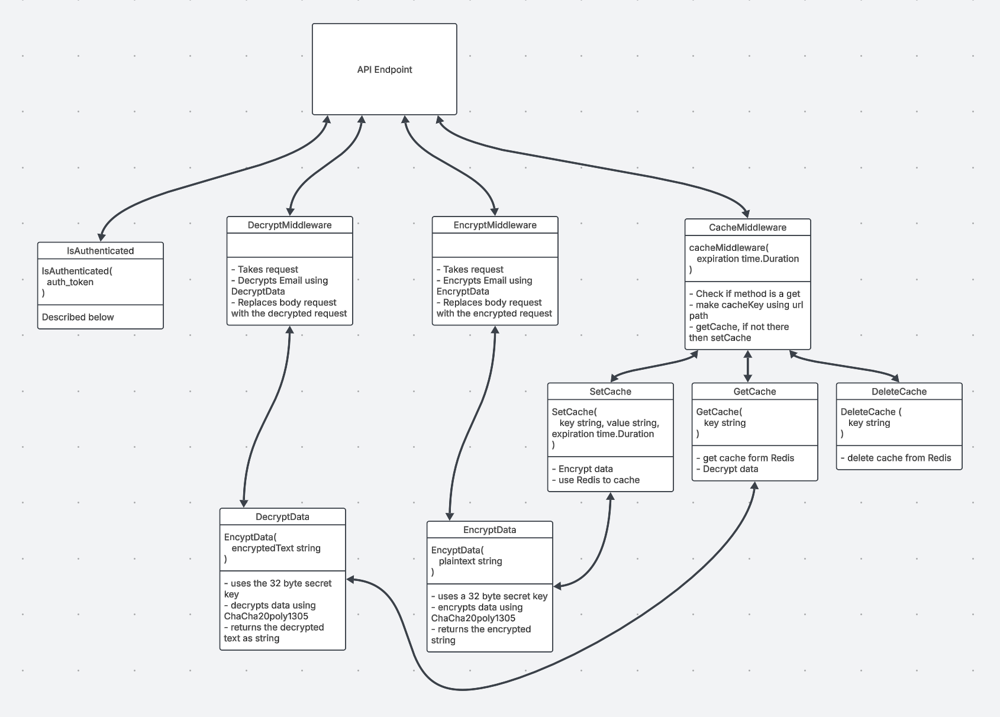

# Low Level Design


## Introduction


### Purpose

This document serves as a reference for developers working on Last Game, ensuring that the development team can work independently while maintaining code compatibility.


### Scope

This document focuses on the specific implementation details.


### Audience

The document is intended for developers to ensure alignment in development.

---


## Backlog Development Plan


### Sprint 1 - Core Development


#### Frontend (Svelte & Phaser)

**What we planned** *(February 17, 2025)*  
- **Authentication Pages**: Login, Signup, Forgot Password.
- **Subscription Page**: Fetch plans, process Stripe payments.
- **Settings Page**: Manage user preferences (dark mode, username, email).
- **Game UI (Phaser)**: Implement basic **scene management**, **player controls**, and **API calls**.
- **Global UI Components**: Navbar, buttons, form inputs.
- **Accessibility Enhancements**: Keyboard navigation, ARIA labels.

**What we did** *(April 21, 2025)*  
\ space to write updated documentation

---


#### Backend

**What we planned** *(February 17, 2025)*  
- **Authentication System**: Register, Login, Refresh Token.
- **API Endpoints**: Game creation, saving, subscriptions.
- **Database Models (GORM)**: User, Game, Floor, Enemies, Rooms, Weapons, Chests.
- **Game State Manager**: CRUD operations for game state.
- **Docker Setup**: Create Docker files for backend deployment.

**What we did** *(April 21, 2025)*  
\ space to write updated documentation

---


#### AI & Procedural Generation

**What we planned** *(February 17, 2025)*  
- **Map Generation**: Ensure rooms are connected, accessible, and have proper door placement.
- **Validation Checks**: Test if rooms and objects (chests, doors) are correctly generated.

---

**What we did** *(April 21, 2025)*  
- Finished floor generation

---


### Sprint 2 - Feature Enhancements

#### Frontend

**What we planned** *(February 17, 2025)*  
- **UI/UX Improvements**: Better form validation, improved error handling.
- **Authentication Features**: Forgot password & change password flow.
- **Phaser Game Improvements**:
  - Implement **room management** system.
  - Add **combat system** (attack, health tracking).
  - Optimize **Svelte-Phaser integration** for UI overlays.

**What we did** *(April 21, 2025)*  
\ space to write updated documentation

---


#### Backend

**What we planned** *(February 17, 2025)*  
- **Subscription Handling**: Implement full Stripe integration.
- **Security Enhancements**: Middleware for authentication, encryption, caching.
- **AI Integration**: Replace placeholder floors/rooms with AI-generated content.

**What we did** *(April 21, 2025)*  
\ space to write updated documentation

---


#### AI & Procedural Generation

**What we planned** *(February 17, 2025)*  
- **Generate Enemies, Weapons, and Chests**: Ensure logical placement and balancing.
- **Add AI-based Tests**: Validate generated elements for format correctness.

---

**What we did** *(April 21, 2025)*  
- Added enemy & weapon generation
- Added basic unit tests
- Added story generation

---


### Sprint 3 - Final Testing & Deployment


#### Frontend

**What we planned** *(February 17, 2025)*  
- **Final Testing**: Unit & End-to-End testing using Svelte Testing Library & Cypress.
- **Performance & Accessibility**: Optimize Lighthouse scores.

**What we did** *(April 21, 2025)*  
\ space to write updated documentation

---


#### Backend

**What we planned** *(February 17, 2025)*  
- **Game State Optimization**: Reduce unnecessary save operations.
- **Final Testing & Debugging**: Deployment preparation.
- **Leaderboard & High Scores**: Implement scoring system API.

**What we did** *(April 21, 2025)*  
\ space to write updated documentation

---


#### AI & Story Generation

**What we planned** *(February 17, 2025)*  
- **Generate AI-based Stories**: Provide narrative elements between floors.

**What we did** *(April 21, 2025)*  
- Cleaned up code & added helpful comments

---


### Sprint Task Breakdown (Tasks to acheive Goals)

**What we planned** *(February 17, 2025)*  


**What we did** *(April 21, 2025)*  
\ space to write updated documentation

---


#### Sprint 1

- **Front end:**
  - **Svelte**
    - **Login Page (`Login.svelte`)**
      - [ ] Fields: **Username, Password**
      - [ ] Buttons: **Login, Forgot Password, Create Account**
      - [ ] API Call: `POST /api/login`
      - [ ] Handles: **Error messages, input validation**
    - **Signup Page (`Signup.svelte`)**
      - [ ] Fields: **Username, Email, Password, Confirm Password**
      - [ ] Form Validation:
        - [ ] **Username availability check**
        - [ ] **Email format validation**
        - [ ] **Password strength enforcement**
      - [ ] API Call: `POST /api/register`
      - [ ] Redirects to **Login page** after successful registration.
    - **Subscription Page (`Subscription.svelte`)**
      - [ ] Displays **subscription tiers** (Monthly, Lifetime).
      - [ ] API Calls:
        - [ ] `GET /api/subscription` (fetch available plans)
        - [ ] `POST /api/subscribe` (process Stripe payment)
      - [ ] Handles:
        - [ ] **Success message for payment**
        - [ ] **Error message if payment fails**
    - **Settings Page (`Settings.svelte`)**
      - [ ] Fields:
        - [ ] **Change Username**
        - [ ] **Change Email**
        - [ ] **Manage Subscription**
        - [ ] **Dark Mode Toggle**
      - [ ] API Calls:
        - [ ] `GET /api/settings` (fetch preferences)
        - [ ] `POST /api/settings` (save preferences)
      - [ ] Saves **preferences in localStorage & Svelte Store**.
    - **Global UI Components**
      - [ ] **Navbar (`Navbar.svelte`)**
        - Links to: **Home, Subscription, Settings**
        - Updates **active page state** using Svelte Stores.
      - [ ] **Reusable Components**
        - `Button.svelte` – Standardized buttons.
        - `FormInput.svelte` – Handles input fields.
    - **Accessibility Focus**
      - [ ] **Keyboard Navigation**: Tab-based control.
      - [ ] **Screen Reader Support**: ARIA labels for important elements.
  - **Phaser**
    - **Scene Management**
      - [ ] Implement `MainMenuScene` with navigation buttons.
      - [ ] Implement `ThemeSelectionScene` and store the selected theme.
      - [ ] Implement `DifficultySelectionScene` and pass selection to the backend.
      - [ ] Implement `GameScene` as an empty shell.
      - [ ] Implement `GameOverScene` and ensure it triggers `SetHighScore(level)`.
    - **Backend API Calls**
      - [ ] Implement `GetFloor(difficultyLevel, theme)` to fetch level data.
      - [ ] Implement `Save(floorObject)` to update enemy/chest data.
      - [ ] Implement `SetHighScore(level)` to update leaderboard.
      - [ ] Implement `GetText()` to fetch AI-generated story text.
    - **Basic Player Controls**
      - [ ] Implement `move(direction)`.
      - [ ] Implement `checkCollision(Player, direction)`.
    - **Basic Enemy System**
      - [ ] Implement enemy movement towards the player (`enemyPathfind(Enemy, Player)`).
      - [ ] Implement simple enemy melee attack (`attack(Player)`).
- **Back end:**
    - [ ] build backend file directory
    - Create Api Endpoints
        - [ ] Implement `/register` endpoint
        - [ ] Implement `/login` endpoint
        - [ ] Implement `/refreshToken` endpoint
        - [ ] Implement `/create_game` endpoint
        - [ ] Implement `/save-game` endpoint
        - [ ] Implement `/subscribe` endpoint
        - [ ] Implement `/unsubscribe` endpoint
        - [ ] Implement **getters and setters** for all models and story

    - Authentication
        - [x] Implement Register
        - [x] Implement Login
        - [x] Implement RefreshToken

    - Database Models (Using GORM)
        - [ ] Create GORM models:
            - [ ] User
            - [ ] Players
            - [ ] Game
            - [ ] Floor
            - [ ] Enemies
            - [ ] Rooms
            - [ ] Weapons
            - [ ] Chests

    - Game State Manager
    - [ ] Create `create_game` method
    - [ ] Create `save_game` method
    - [ ] Implement **setters and getters** for all models
        - [ ] Create **template models** for frontend use

    - Build Docker Containers For Backend
        - [x] Get all Requirements for Backend Code
        - [x] Create docker file
        - [x] set whole team up with docker file

  - AI
    - [x] Set up main script so that the server can invoke prompts
    - [x] Add map generation
      - [x] Add checks to make sure each doorway/chest can be accesed
      - [x] Add checks to make sure there is >= 1 door in each room
      - [x] Connect rooms together to make the floor
      - [x] If generation fails, use a default room


---


#### Sprint 2
 
- **Front end:**
  - **Svelte**
    - **UI/UX Improvements**
      - [ ] Improve **form validation & error messages**.
    - **Authentication Improvements**
      - [ ] **Forgot Password Page (`ForgotPassword.svelte`)**
        - API Call: `POST /api/reset-password`
        - Handles: **Sending password reset link via email**.
      - [ ] **Change Password Page (`ChangePassword.svelte`)**
        - Fields: **Current Password, New Password, Confirm Password**
        - API Call: `POST /api/update-password`
        - Requires **current password validation**.
    - **Navigation & Accessibility**
      - [ ] Improve **keyboard shortcuts** for better navigation.
      - [ ] Implement **high contrast mode** for visually impaired users.
  - **Phaser**
    - **Room Management**
      - [ ] Implement `RoomObject` and different room types (`NormalRoom`, `ChestRoom`, `StairRoom`).
      - [ ] Implement `getRoomAt(x, y)`.
      - [ ] Implement `loadRoom(Room room)`.
      - [ ] Implement `generateFloor(FloorObject floor)`.
      - [ ] Implement `generateRoom(RoomObject room)`.

    - **Combat & Health System**
      - [ ] Implement `attack(Player)` logic.
      - [ ] Implement enemy health tracking.
      - [ ] Implement player health tracking.

    - **Phaser-Svelte Integration**
      - [ ] Implement event handling to pause/resume Phaser when Svelte UI is open.
      - [ ] Ensure seamless UI overlay with proper layering.

    - **UI & Overlays**
      - [ ] Implement `ChestOpeningScene`.
      - [ ] Implement `LoseLifeScene`.
      - [ ] Implement `SettingsScene`.
- **Back end:**
    - [ ] Implement `createSubscription`
    - [ ] Add all stripe Methods in .auth file
    - [ ] Replaces Floor and Room Templates with the AI generated Floors and Rooms
    - [x] Implement `isAuthenticated` middleware
    - [ ] Implement `Decryption` logic
    - [x] Implement `Encryption` logic
    - [ ] Implement `Caching` mechanism
    - [ ] When AI code is finished, update templates for:
        - [ ] Enemies
        - [ ] Weapons
        - [ ] Chests
  - AI:
    - [x] Add option to generate enemies
      - [x] Add check to see if enemy is valid
      - [x] If generation fails, use default enemy
    - [x] Add option to generate weapons
      - [x] Add check to see if weapon is valid
      - [x] If generation fails, use default weapon
    - [x] Add tests for enemies, weapons, chest generation
      - [x] Check if response is in proper format
      - [x] Check if there are enough chests in the floor ( >= 3)
    - [x] Add story generation for in between floors


---


#### Sprint 3

- **Front end:**
  - **Svelte**
    - **Final Testing & Debugging**
      - [ ] **Unit Testing** with **Svelte Testing Library**.
      - [ ] **End-to-End Testing** with **Cypress**.
      - [ ] **Accessibility Testing** using **Google Lighthouse**.
  - **Phaser**
    - **Save Optimization (Phaser)**
      - [ ] Implement `compareFloorState(Floor oldFloor, Floor newFloor)`.
      - [ ] Ensure `Save()` only updates changed elements.
      - [ ] Call `Save()` when opening a chest (`openChest(Chest chest)`).
      - [ ] Call `Save()` when progressing to a new floor (`progressToNextFloor()`).
    - **Final Polish (Phaser)**
      - [ ] Optimize floor loading to load only adjacent rooms.
      - [ ] Implement animations for movement, attacks, and UI transitions.
      - [ ] Implement additional sound effects for interaction.
      - [ ] Final round of playtesting for balancing and bug fixes.
      - [x] Add music and sound effects

- **Back end:**
    - [ ] Implement Story generation for between floors
    - [ ] Final Testing
    - [ ] Work on Deployment Plan for backend
    - [ ] Implement endpoints for high score and leader board


---


## System Architecture


### Subsystems and UML Class Diagrams


#### **Scene Structure & UML Layout - Phaser**

**What we planned** *(February 17, 2025)*  
The game consists of the following **scenes**:

1. **MainMenuScene** - Displays title screen, allows navigation to settings or new game.
2. **ThemeSelectionScene** - Lets the player choose a theme between 3 options.
3. **DifficultySelectionScene** - Selects difficulty (Easy-Medium-Hard); passes to backend for floor generation.
4. **StoryScene** - Displays AI-generated story text while a new floor loads.
5. **GameScene** - Main gameplay scene (handles player movement, enemy interactions, etc.).
6. **LoseLifeScene** - Triggered when the player dies but has remaining lives.
7. **GameOverScene** - Triggered when the player loses all lives; passes level to backend for high-score update.
8. **ChestOpeningScene** - Displays chest contents after opening; triggers save.
9. **SettingsScene** - Allows the player to manually save, adjust settings, or return to the main menu.

**What we did** *(April 21, 2025)*  
\ space to write updated documentation

---


##### **Scene Interactions**

**What we planned** *(February 17, 2025)*  
- `MainMenuScene` → `ThemeSelectionScene` → `DifficultySelectionScene` → `StoryScene` → `GameScene`
- `GameScene` → (`LoseLifeScene` or `ChestOpeningScene`) → `GameScene`
- `GameScene` → `GameOverScene` → `MainMenuScene`
- `SettingsScene` is accessible from `GameScene` at any time.

**What we did** *(April 21, 2025)*  
\ space to write updated documentation

---


#### **Class Design & Inheritance - Phaser**

**What we planned** *(February 17, 2025)*  
Phaser will be passed all of this information from the backend when calling the `create-game` endpoint. It will create copies of all of these classes to update as the User interacts with the game. The following are the names and descriptions of all the classes that Phaser will use:

**What we did** *(April 21, 2025)*  
\ space to write updated documentation

---


##### **Rooms**

**What we planned** *(February 17, 2025)*  
```plaintext
Room (abstract)
│-- NormalRoom
│-- ChestRoom (contains a Chest)
│-- StairRoom (contains a Stair)
```
- `Room`
  - `number type` 0: Normal, 1: Chest, 2: Stair.
  - `string[][] tiles` Contains single-character entries denoting the type of tile.
  - `EnemyObject[] enemies` Contains all enemies within the room.
  - `boolean isCleared()`
  - `updateEnemies(EnemyObject[])`

**What we did** *(April 21, 2025)*  
\ space to write updated documentation

---


##### **Interactable Objects**

**What we planned** *(February 17, 2025)*  
```plaintext
Interactable (abstract)
│-- Chest
│-- Stair
```
- `Interactable`
  - `boolean interact(Player)`

**What we did** *(April 21, 2025)*  
\ space to write updated documentation

---


##### **Other Classes**

**What we planned** *(February 17, 2025)*  
- `Floor`
  - `String theme` The theme of the dungeon.
  - `number level`
  - `RoomObject[][] rooms` Contains all room objects in the floor
  - `RoomObject getRoomAt(number x, number y)` Returns a given RoomObject
- `Player`
  - `number health, posX, posY`
  - `move(direction)` Updates posX and posY.
  - `Item primaryWeapon, secondaryWeapon`
- `Enemy`
  - `number health, posX, posY`
  - `Item weapon`
  - `attack(Player)`
- `Item`
  - `string sprite`
  - `number damage`
  - `number type` 0: Melee, 1: Ranged, 2: Sweep, 3: AoE

**What we did** *(April 21, 2025)*  
\ space to write updated documentation

---


#### **Backend Interactions - Phaser**


##### **API Endpoints**

**What we planned** *(February 17, 2025)*  
| Endpoint | Request | Response | Purpose |
|----------|---------|----------|---------|
| `GetFloor(number difficultyLevel, String theme)` | `difficultyLevel, theme` | `FloorObject` | Retrieves floor layout, rooms, enemies. |
| `Save(Floor floorObject)` | `floorObject` | `200 OK` | Saves only updated enemy/chest attributes. |
| `GetText()` | None | `String` | Returns AI-generated story text. |
| `SetHighScore(number level)` | `level` | `200 OK` | Updates leaderboard on game over. |

**What we did** *(April 21, 2025)*  
\ space to write updated documentation

---


#### **Utility Functions - Phaser**


##### **1. Room & Floor Management**

**What we planned** *(February 17, 2025)*  
- `loadRoom(Room room)`: Loads a room when entered.
- `generateFloor(FloorObject floor)`: Initializes floor data from backend response.
- `generateRoom(RoomObject room)`: Places tiles, enemies, and objects.

**What we did** *(April 21, 2025)*  
\ space to write updated documentation

---


##### **2. Collision & Movement**

**What we planned** *(February 17, 2025)*  
- `checkCollision(Player, direction)`: Ensures movement is valid.
- `enemyPathfind(Enemy, Player)`: Moves enemies toward the player.

**What we did** *(April 21, 2025)*  
\ space to write updated documentation

---


##### **3. Save & Compare Changes**

**What we planned** *(February 17, 2025)*  
- `compareFloorState(Floor oldFloor, Floor newFloor)`: Determines what changed before saving. This optimizes Save() by only sending to the backend what changed.
- `openChest(Chest chest)`: Calls `Save()` when a chest is opened. Prompts the user to take or leave the item.
- `progressToNextFloor()`: Calls `GetFloor()` for the next level.

**What we did** *(April 21, 2025)*  
\ space to write updated documentation

---


#### **Phaser-Svelte Interaction**

**What we planned** *(February 17, 2025)*  
- **Svelte UI overlays Phaser**, pausing the game when active.
- Phaser listens for an event to **resume** gameplay when UI is closed.
- Svelte handles **login, leaderboards, accessibility settings, and subscription services**; Phaser handles **all other UI**.

**What we did** *(April 21, 2025)*  
\ space to write updated documentation

---


#### Front-End Objects - Svelte

**What we planned** *(February 17, 2025)*  
The frontend follows a **Component-Based Architecture** using **Svelte** with modular, reusable components.

**What we did** *(April 21, 2025)*  
\ space to write updated documentation

---


#### **Frontend Subsystems & Component Breakdown - Svelte**

**What we planned** *(February 17, 2025)*  
Each subsystem is implemented using **Svelte components**.

| **Component**       | **Purpose** |
|---------------------|------------|
| `Login.svelte` | Handles user authentication UI (input fields, validation) |
| `Signup.svelte` | UI for account registration, form validation |
| `Subscription.svelte` | UI for selecting and processing payments via Stripe API |
| `Settings.svelte` | User preferences (Appearance, Account settings) |
| `Game.svelte` | Embeds **Phaser.js** for game rendering |
| `Navbar.svelte` | Persistent navigation bar |
| `Button.svelte` | Reusable button component |
| `FormInput.svelte` | Handles form inputs (text, password) |
| `Modal.svelte` | Displays popups (notifications, alerts) |
| `ToastNotification.svelte` | Shows success/error messages |
| `LoadingSpinner.svelte` | Displays a loading animation while waiting for API responses |

**What we did** *(April 21, 2025)*  
\ space to write updated documentation

---


#### **State Management**

**What we planned** *(February 17, 2025)*  
We use **Svelte Stores** to efficiently manage UI state.

| **Store Name**  | **Purpose** |
|----------------|------------|
| `authStore.js` | Stores authentication state (user session, token) |
| `uiStore.js` | Stores UI preferences (dark mode, accessibility settings) |

**What we did** *(April 21, 2025)*  
\ space to write updated documentation

---


### **Key User Interactions**

**What we planned** *(February 17, 2025)*  
1. **User visits the Login Page (`Login.svelte`)**
   - Enters credentials → API Request → Redirect to Dashboard.
   - If incorrect credentials → Display **error message**.
   - If a new user → Clicks “Create Account” → Redirects to Signup.

   - **Elements:** Username, Password fields, Submit button.
   - **Interactions:** Redirects to Dashboard if login is successful.
   - **Accessibility:** Supports **keyboard navigation & screen readers**.

2. **Signup Process (`Signup.svelte`)**
   - User fills out form → API Request to register.
   - Email validation check → If invalid, **error message**.
   - If successful → Redirect to **Login Page**.
   - **Elements:** Username, Email, Password fields, Submit button.
   - **Interactions:** Redirects to Dashboard if signup is successful.
   - **Accessibility:** Supports **keyboard navigation & screen readers**.

3. **Subscription Process (`Subscription.svelte`)**
   - User selects plan → Processes payment via **Stripe API**.
   - If successful → Grants **premium features**.
   - **Elements:** Monthly & Lifetime subscription options.
   - **Interactions:** Payment processing via **Stripe API**.
   - **Error Handling:** Displays **errors on failed transactions**.

4. **Settings Page (`Settings.svelte`)**
- **Elements:** Change Username, Update Preferences.
- **Interactions:** Saves settings in **local storage & database**.

**What we did** *(April 21, 2025)*  
\ space to write updated documentation

---


#### Accessibility

**What we planned** *(February 17, 2025)*  
We ensure **UI accessibility compliance** with **WCAG standards**.

**Keyboard Navigation** – `Tab` key support for form fields
**Color Contrast Compliance** – Ensuring readability for visually impaired users
**Screen Reader Support** – Adding `aria-label` attributes to key elements

**What we did** *(April 21, 2025)*  
\ space to write updated documentation

---


#### Flow and Design for Pages

**What we planned** *(February 17, 2025)*  
The Phaser application containing all game-related UI will be embeded within a Svelte page. Each component will work independently in a sort-of baton pass system to display all the necessary pages. The following UML diagram displays this interaction and outlines all frontend pages and scenes.


**What we did** *(April 21, 2025)*  
\ space to write updated documentation

---


## **Database Interaction (API Endpoints)**

**What we planned** *(February 17, 2025)*  
The frontend communicates with **backend APIs** to fetch/update user data.

| **API Endpoint**       | **Purpose** |
|-----------------------|------------|
| `POST /api/login` | Authenticates users |
| `POST /api/register` | Creates new accounts |
| `GET /api/subscription` | Fetches available plans |
| `POST /api/subscribe` | Processes payment |
| `GET /api/settings` | Fetches user preferences |
| `POST /api/settings` | Updates user preferences |

**What we did** *(April 21, 2025)*  
\ space to write updated documentation

---


## Database Tables


### Users Table

**What we planned** *(February 17, 2025)*  
* **Table purpose:** Stores account details for each user. Our subscription level will be an integer telling which type of payment plan they are on and the stripeId being the identifier for stripe since that is all we need for them to be abler to run and process payemnts for our user on the backend.
* **Columns:** `userId:(primary key) int | username: string | email:(encrytped) string | password:(hashed) string | subscriptionLevel: int | stripeId: int`

**What we did** *(April 21, 2025)*  
\ space to write updated documentation

---


### Players Table

**What we planned** *(February 17, 2025)*  
* **Table purpose:** Represents a character controlled by a user. The player will be how the User is able to interact with and traverse through the game. The player will have a specific sprite id which will tell the front end which specific sprites to give the player based on different assumptions the AI has made about the type of game the user would like to play.
* **Columns:** `playerId:(primary key) int | userId:(foreign key) int | health: int | primaryWeapon:(foreign key) Weapon | secondaryWeapon:(foreign key) Weapon | spriteId: int`

**What we did** *(April 21, 2025)*  
\ space to write updated documentation

---


### Games Table

**What we planned** *(February 17, 2025)*  
* **Table purpose:** Stores details about the game session. The game object will be the main object in the game that gets saved when the user wants to save the game state. The game objectw will be updated in the database either after a major level is finished or if the user presses the **"Save Game"** option in the menu.
* **Columns:** `gameId:(primary key) int | level: int | floorId:(foreign key) Floor Object | playerSpecifications: string | playerId:(foreign key) Player Object | storyText: string`

**What we did** *(April 21, 2025)*  
\ space to write updated documentation

---


### Floors Table

**What we planned** *(February 17, 2025)*  
* **Table purpose:** Stores information about different game maps. The floor will store all the needed rooms necessary for the floor object. This will be stored in a two dimensional array. Some of the pieces of the array will contain room objects and some will be null. The floor will only be made up of the valid room objects. The playerIn attribute will be the identifier of the last room the player was in before the game object gets saved. This will allow the player to respawn back into the last room they were in when they try to load up their game again.
* **Columns:** `floorId:(primary key) int | rooms: 2d array of Room objects | playerIn: Room Object`

**What we did** *(April 21, 2025)*  
\ space to write updated documentation

---


### Enemies Table

**What we planned** *(February 17, 2025)*  
* **Table purpose:** Stores information about in-game enemies. The enemies will be generated and placed into specific rooms.
* **Columns:** `enemyId:(primary key) int | attackLevel: int | attackFrequency: int | health: int | spriteId: int`

**What we did** *(April 21, 2025)*  
\ space to write updated documentation

---


### Rooms Table

**What we planned** *(February 17, 2025)*  
* **Table purpose:** Stores a room's details. A room is considered **cleared** when all of the enemies in the room have been defeated. This will be an indicator if the room needs to be updated in the database or not when the user saves the Game state object.
* **Columns:** `roomId:(primary key) int | enemies: List of Enemy objects | chest: Chest Object | adjacentFloors: A list of adjacent Floor Objects | cleared: boolean`

**What we did** *(April 21, 2025)*  
\ space to write updated documentation

---


### Weapon Table

**What we planned** *(February 17, 2025)*  
* **Table purpose:** Stores weapon details.
* **Columns:** `weaponId:(primary key) | health: int | attackDamage: int`

**What we did** *(April 21, 2025)*  
\ space to write updated documentation

---


### Chest Table

**What we planned** *(February 17, 2025)*  
* **Table purpose:** Represents a one-to-many relationship between rooms and chests.
* **Columns:** `chestId:(primary key) int | roomId:(foreign key) Room Object | weaponId:(foreign key) Weapon Object`

**What we did** *(April 21, 2025)*  
\ space to write updated documentation

---


### Backend UML

**What we planned** *(February 17, 2025)*  


**What we did** *(April 21, 2025)*  
\ space to write updated documentation

---


#### Game State Manager

**What we planned** *(February 17, 2025)*  


**What we did** *(April 21, 2025)*  
\ space to write updated documentation

---


#### LLM functions

**What we planned** *(February 17, 2025)*  


**What we did** *(April 21, 2025)*  
- Mostly stayed the same, but excluded choosing the player sprite
- Also added enemy generation, which follows the same pattern as weapon generation

---


#### LLM Flow Chart

**What we planned** *(February 17, 2025)*  


**What we did** *(April 21, 2025)*  
- removed `choosePlayerSprite`
- added function to make an enemy

---


### System Performance

**What we planned** *(February 17, 2025)*  
In order to address the latency that LLMs introduce, we are using Groq to handle the computations needed to handle the LLMs. Groq offers access to LLMs on a generous limit for free users. Each user will be responsible for creating a Groq account and getting an API key. This will allow the game to be able to scale with the number of users so long as Groq's servers can handle the number of users.

**What we did** *(April 21, 2025)*  
\ space to write updated documentation

---


### Security Risks

Last Game is structured in such a way as to block as many potential security risks as possible from the get-go. Last Game will only collect information that is absolutely necessary for a functioning game with accounts, including username, password, and email. Collecting little information will lessen risks of sensitive data leaks due to bad actors, This will also ensure Last Game complies with privacy Laws such as GDPR. Security for other portions of the project are handleded by the external services, such as Stripe or the Groq AI, that Last Game will make API calls to. For more information on how the security of these services will work with Last Game, see the following sections:

[Stripe](#stripe) | [Groq](#groq) | [Postgres](#postgres)

For other security concerns mentioned in the High-Level Design Document, NaN's approach is to divide them between the following sections:

---


### Authentication

**What we planned** *(February 17, 2025)*  


Last Game will use JWT tokens for authenticating players. This approach will validate users that have logged in and will engage both the back end and front end to ensure user's game sessions are unique to them. When users create an account or log in, a token will be created and sent to the front end. The front end will then send the token through the Authorization header to the backend, which will validate that the user is authorized to retrieve relevant information. This approach will help with validating if users are subscribed or not in regards to Stripe and will keep each user's game experience consistent throughout their sessions and after playing and saving the game.

Implementation of JWT authentication will be done using the robust Go module jwt-go found at https://github.com/golang-jwt/jwt. This module offers multiple methods that will be helpful:

**What we did** *(April 21, 2025)*  
\ space to write updated documentation

---


### Key  Methods

**What we planned** *(February 17, 2025)*  
| Method | Purpose |
|---------------|---------|
| `jwt.NewWithClaims(jwt.SigningMethodHS256, claims)` | Creates a new JWT token with claims. |
| `token.SignedString(secretKey)` | Signs the JWT with a secret key and generates the token string. |
| `jwt.Parse(tokenString, keyFunc)` | Parses and validates a JWT token. |
| `jwt.ParseWithClaims(tokenString, claims, keyFunc)` | Parses a token and extracts claims. |
| `jwt.NewNumericDate(time.Now().Add(time.Hour * 24))` | Sets an expiration time for a token. |

**What we did** *(April 21, 2025)*  
\ space to write updated documentation

---


### Common JWT Claim Fields

**What we planned** *(February 17, 2025)*  
| Claim | Description |
|-------|-------------|
| `sub` | Subject (user ID). |
| `exp` | Expiration time. |
| `iat` | Issued at timestamp. |
| `email` | Stores encrypted email (for additional security). |

Encryption of user passwords will be done using Go's cryptography package and will use specifically bycrypt, found at golang.org/x/crypto/bcrypt. Bycrypt automatically adds salt to encrypted strings and has provisions for cost factors. The following are related methods offered that will be used:

**What we did** *(April 21, 2025)*  
\ space to write updated documentation

---


### Methods for Hashing & Verifying Sensitive Data

**What we planned** *(February 17, 2025)*  
| **Method** | **Purpose** |
|------------|------------|
| `bcrypt.GenerateFromPassword([]byte(password), bcrypt.DefaultCost)` | Hashes a password securely. |
| `bcrypt.CompareHashAndPassword([]byte(hashedPassword), []byte(password))` | Compares a hashed password with a plaintext password. |
| `bcrypt.DefaultCost` | Default security level (cost factor of **10**). |
| `bcrypt.MinCost` | Lowest security (cost **4**, will probably not be used). |
| `bcrypt.MaxCost` | Maximum security (cost **31**, very slow). |


For authentication specifically, these methods will be used in the following:
* Create_account()
    - recieves user information (username, password, email) from front end, encrypts the password and email, and creates a JWT token (jwt.NewWithClaims(), token.SignedString()), and sends it to the database for storage
* Login()
  - recieves user information, checks it against the database, if match then sign in and create JWT token ((jwt.NewWithClaims(), token.SignedString())), if not then rejects sign in
* Refresh_token()
  - Creates a refresh token that will be sent with the access token so that new access tokens can be created without logging out the user.

**What we did** *(April 21, 2025)*  
\ space to write updated documentation

---


### Middleware

**What we planned** *(February 17, 2025)*  


Following initial encryption and token creation in authentication, any time the user does something that needs authenticating from the front end, endpoints called will be wrapped in middleware. One of these middlewares will be isAuthenticated(), which will be used in the following process:

| **Step** | **Action** |
|----------|-----------|
| **1. User Logs In** | `login()` verifies password → Issues JWT token. |
| **2. User Makes Request** | Frontend sends JWT in the `Authorization` header. |
| **3. Middleware Runs** | `isAuthenticated()` extracts and verifies the token. |
| **4. If Token is Valid** | The request is allowed; user ID is extracted and added to context. |
| **5. If Token is Invalid** | Request is blocked (`401 Unauthorized`). |

The middleware checks the JWT token by:

1. Extracting the token from the Authorization header.
2. Validating the token's signature, expiration, and claims.
3. Extracting user data from the token and attaching it to the request context.
4. Allowing or blocking the request based on validation.

This will ensure that the requested data is sent to the correct users.

---

**What we did** *(April 21, 2025)*  
\ space to write updated documentation

---


## Programming Languages and Frameworks


### Front End


#### Frameworks

**What we planned** *(February 17, 2025)*  
- Svelte
- Phaser.js

**What we did** *(April 21, 2025)*  
\ space to write updated documentation

---


#### Languages

**What we planned** *(February 17, 2025)*  
- TypeScript
- HTML
- CSS

**What we did** *(April 21, 2025)*  
\ space to write updated documentation

---


### Back End


#### Frameworks

**What we planned** *(February 17, 2025)*  
- Gin

**What we did** *(April 21, 2025)*  
\ space to write updated documentation

---


#### Modules Used

**What we planned** *(February 17, 2025)*  
- Redis for caching
- Bcypt for password encyption
- ChaCha20poly1305 for data encyption
- GORM for ORM
- LangChain for AI Agent

**What we did** *(April 21, 2025)*  
\ space to write updated documentation

---


#### Languages

**What we planned** *(February 17, 2025)*  
- Golang
- Python

**What we did** *(April 21, 2025)*  
\ space to write updated documentation

---


### APIs and External Interfaces


#### **Stripe:**

**What we planned** *(February 17, 2025)*  
Stripe will be used to process payment information for subscriptions to Last Game. Code related to executing Stripe functions  will reside in the Authentication file. Payment information will be input through the front end subscription page, and related information will be sent to the back end and processed in the Authentication file.
* Create Developer Account with Stripe
* Secure API key and store in environment variables to keep key secure
* Use the Stripe SDK built for Go, github.com/stripe/stripe-go/ to accomplish the following taks:

| Task | Prebuilt in SDK | Custom Code Needed |
|------|-----------------|---------------------|
| Create a customer |  `customer.New()` | Store `customer.ID` in DB |
| Subscribe a customer |  `sub.New()` | Store subscription details (isSubscribed(), subscription ID) |
| Handle webhook events (did payment go through?) |  `webhook.ConstructEvent()` | Update user’s premium access |
| Check subscription status | ❌ | Query database for existence of customer ID and subscription ID |

* Back end recieves a Stripe Id that will be processed via process_payment() in the authentication file. The method will check that the email associated with the Stripe ID matches the email associated with the current user and either validate or deny moving forward with the subscription.

* The back end will return a Stripe URL to the front end that will take the user to the payment screen. After processing payment and verifying with the backend through the webhook that the payment was successful or rejected, Stripe will redirect to our front end site.

This approach  should increase security by removing the need to store payment information in the database. The database will only interact with customer and subscription IDs, meaning the database will never see sensitive payment information. That information and security will be offloaded to Stripe, which is well known and trusted in the community.

**What we did** *(April 21, 2025)*  
\ space to write updated documentation

---


#### **Groq**

**What we planned** *(February 17, 2025)*  
Groq will be used to handle the hardware requirements that LLMs have, as explained in [System Performance](#system-performance). Users will be in charge of creating a Groq account from the [Groq dashboard](https://console.groq.com/login) and getting an API key. Users can manage their API key in the .env file if they need to delete or change the API key.

**What we did** *(April 21, 2025)*  
\ space to write updated documentation

---


## Deployment Plan


### Docker

**What we planned** *(February 17, 2025)*  
Docker allows the team to avoid "it works on my machine" issues, removes the need for each team member to download every software on the front end and back end to test the game, and makes deployment simple long term. Every team member will be able to fully focus on their respective components or assignments, allowing for a smoother development and testing process. As such, setting up docker for the game is a high priority task and involves the following steps:

1. Make docker account and download docker
2. Create Dockerfile for the back end (GO)
3. Create a Dockerfile for the front end (Svelte + Phaser)
4. Combine separate dockerfiles into an aggregate docker-compose.yml file (this file will encapsulate the Postgres database as well)
5. Ensure External APIS are properly called from the aggregate file by the following table:

| API | How It's Accessed | Example Code |
|------|----------------|---------|
| **Stripe** | Backend makes HTTPS calls | `payments.HandleStripeWebhook()` |
| **AI (Groq)** | Backend sends HTTP requests | `ai.GenerateRoomLayout()` |
| **Phaser.js** | Runs in frontend, served via browser | `import Phaser from "phaser";` |
| **PostgreSQL** | Runs in Docker, backend connects via `DATABASE_URL` | `gorm.Open(postgres.Open(dsn))` |
6. Use docker compose to start and stage the project

**What we did** *(April 21, 2025)*  
\ space to write updated documentation

---


#### 1. **Development Environment Setup**

**What we planned** *(February 17, 2025)*  
* **Version Control**: We will be utilizing Git and Gitlab to keep track of our work.
* Technology Stack:
	* **FrontEnd**: Svelte, TypeScript, Vite, Phaser.js
	* **BackEnd**: Go Gin, GORM, Stripe
	* **DataBase**: Postgres
* Local Environments:
	* Docker Containers will be utilized to keep all of our local environments acting with the same underlying operating system and technologies.

**What we did** *(April 21, 2025)*  
\ space to write updated documentation

---


#### 2. **Development Pipeline**:

**What we planned** *(February 17, 2025)*  
* We will be utilizing GitLab CI/CD to ensure that any new changes or additions to the code must pass all required unit tests before being merged into the master branch.
* Other conditions such as build time and network latency must be passed as well before being merged.
* All pull request must be approved by at least the team lead at the time and whoever works within a similar development realm as the submitter.

**What we did** *(April 21, 2025)*  
\ space to write updated documentation

---


#### 3. **User Acceptance Testing**

**What we planned** *(February 17, 2025)*  
* Ensure the UI, UX, and MVP is suitable for the key stakeholders in the project.
* Check ups with the customer after major changes or updates have been pushed to ensure that we are all still aligned with our goals and values.

**What we did** *(April 21, 2025)*  
\ space to write updated documentation

---


#### 4. **Production Environment/Deployment**

**What we planned** *(February 17, 2025)*  
* Front End:
	* Will be hosted on Amazon CloudFront in a region closest to the major customers are to ensure quick access to edge locations where cached information will be stored.
	* Will utilize Route53 for our domain name system service.
	* Will utilize AWS S3 for storing any of our needed static assets such as our build folder generated from vite.

* Back End:
	* Amazon ECS will be needed for delploying our docker containers.
	* We can utilize AWS Elastic Beanstalk for simple deployment
	* Amazon API Gateway will be utilized for a secure connection between the front end and backend services.
* Database:
	* Amazon RDS will be utilized for our Postgres SQL database.
* Scalability:
	* Amazon Auto Scaling and Load Balancer will be utilized to automatically scale our backend servers based on set network parameters we choose.
	* Amazon CloudWatch will be utilized for gathering data on performance and traffic.
* Maintainance:
	* Amazon CodePipeline will allow for a seemless transition between our local code and our production, cloud hosted code. Any changes or fixes we need to do will be automatically updated through CodePipeline by updating whenever we make pushes/merges to our master branch.
	* Frequent updates including bug tickets, network updates/improvements, and needed UX changes will be sent to the backlog so there will always be continual improvement upon the gameplay for the users.

**What we did** *(April 21, 2025)*  
\ space to write updated documentation

---

