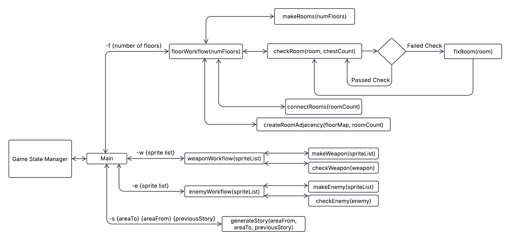
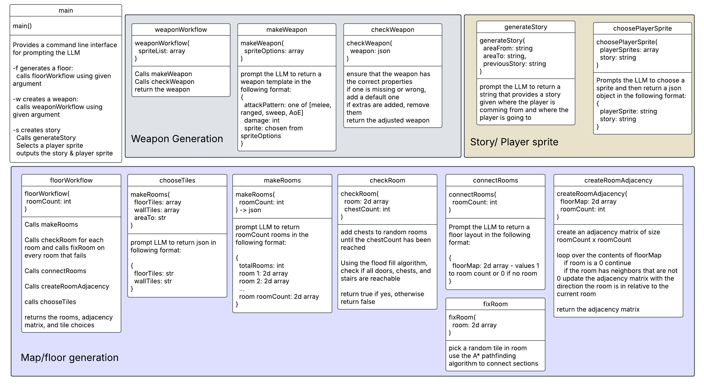

# Low Level Design

# [Please Look at this Link!! It has the rubric and needs for our document](https://usu.instructure.com/courses/769837/assignments/4714896)

## Introduction

---

## Backlog Development Plan
- ### Sprint Breakdown (Sprint Goals)
  - **Sprint 1**
  - **Sprint 2**
  - **Sprint 3**

### Sprint Task Breakdown (Tasks to acheive Goals)
#### Sprint 1
- **Front end:**
- **Back end:**
  - AI:
    - Set up main script so that the server can invoke prompts
    - Add map generation
      - Add checks to make sure each doorway/chest can be accesed
      - Add checks to make sure there is >= 1 door in each room
      - Connect rooms together to make the floor
      - If generation fails, use open room
    - Add map generation tests
      - check if each room is accessible
      - check to see if reponse is in a proper format
#### Sprint 2
- **Front end:**
- **Back end:**
  - AI:
    - Add option to generate enemies
      - Add check to see if enemy is valid
      - If generation fails, use default enemy
    - Add option to generate weapons
      - Add check to see if weapon is valid
      - If generation fails, use default weapon
    - Add chest generation to room/floor
    - Add tests for enemies, weapons, chest generation
      - Check if response is in proper format
      - Check if there are enough chests in the floor ( >= 3)
#### Sprint 3
- **Front end:**
- **Back end:**
  - AI:
    - Add story generation for in between floors

### All Tasks Outline (Summary of all Tasks)

---
## System Architecture
### Subsystems and UML Class Diagrams
#### Front-End Objects

#### User Flow

### User Interfaces
#### Accessibility
#### Flow and Design for Pages
- AI Flow Chart

### Database Tables

### Backend UML
AI functions

### System Performance

### Security Risks

---
## Programming Languages and Frameworks
### Front End
### Back End
### APIs and External Interfaces

## Deployment Plan
### These are ideas! I took them from the best example, we can come up with our own!
- **Development Environment Setup**
- **Staging Environment**
- **User Acceptance Testing**
- **Production Environment Testing**
- **Production Deployment**
- **Monitoring and Maintenance**
- **Scaling**