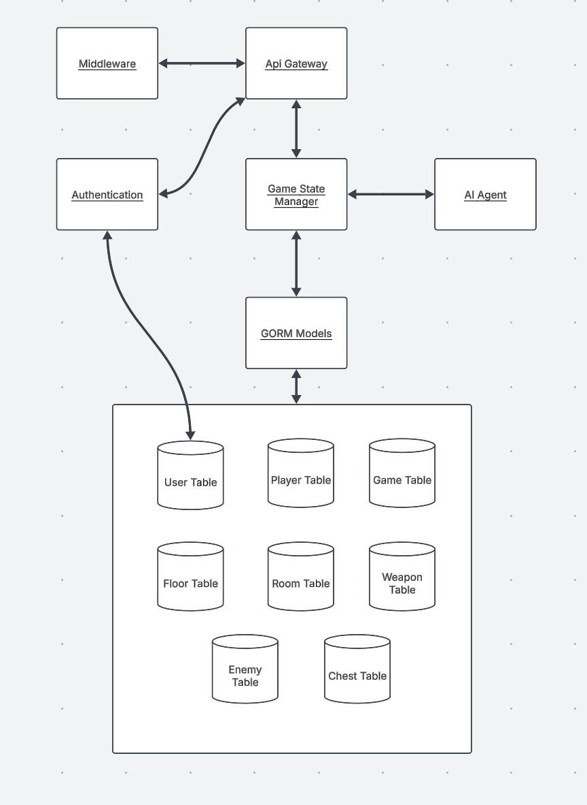

# Low Level Design

# [Please Look at this Link!! It has the rubric and needs for our document](https://usu.instructure.com/courses/769837/assignments/4714896)

## Introduction

---

## Backlog Development Plan
- ### Sprint Breakdown (Sprint Goals)
  - **Sprint 1**
  - **Sprint 2**
  - **Sprint 3**

### Sprint Task Breakdown (Tasks to acheive Goals)
#### Sprint 1
- **Front end:**
- **Back end:**
#### Sprint 2
- **Front end:**
- **Back end:**
#### Sprint 3
- **Front end:**
- **Back end:**

### All Tasks Outline (Summary of all Tasks)

---
## System Architecture
### Subsystems and UML Class Diagrams
#### Front-End Objects

#### User Flow

### User Interfaces
#### Accessibility
#### Flow and Design for Pages

### Database Tables

### Backend UML

### System Performance

### Security Risks
Last Game is structured in such a way as to block as many potential security risks as possible from the get-go. Last Game will only collect information that is absolutely necessary for a functioning game with accounts, including username, password, and email. Collecting little information will lessen risks of sensitive data leaks due to bad actors, This will also ensure Last Game complies with privacy Laws such as GDPR. Security for other portions of the project are handleded by the external services, such as Stripe or the Groq AI, that Last Game will make API calls to. For more information on how the security of these services will work with Last Game, see the following sections:

[Stripe](#stripe) | [Groq](#groq) | [Postgres](#postgres)

For other security concerns mentioned in the High-Level Design Document, NaN's approach is to divide them between the following sections:

### Authentication

Last Game will use JWT tokens for authenticating players. This approach will validate users that have logged in and will engage both the back end and front end to ensure user's game sessions are unique to them. When users create an account or log in, a token will be created and sent to the front end. The front end will then send the token through the Authorization header to the backend, which will validate that the user is authorized to retrieve relevant information. This approach will help with validating if users are subscribed or not in regards to Stripe and will keep each user's game experience consistent throughout their sessions and after playing and saving the game.

Implementation of JWT authentication will be done using the robust Go module jwt-go found at https://github.com/golang-jwt/jwt. This module offers multiple methods that will be helpful:

### Key  Methods
| Method | Purpose |
|---------------|---------|
| `jwt.NewWithClaims(jwt.SigningMethodHS256, claims)` | Creates a new JWT token with claims. |
| `token.SignedString(secretKey)` | Signs the JWT with a secret key and generates the token string. |
| `jwt.Parse(tokenString, keyFunc)` | Parses and validates a JWT token. |
| `jwt.ParseWithClaims(tokenString, claims, keyFunc)` | Parses a token and extracts claims. |
| `jwt.NewNumericDate(time.Now().Add(time.Hour * 24))` | Sets an expiration time for a token. |

### Common JWT Claim Fields
| Claim | Description |
|-------|-------------|
| `sub` | Subject (user ID). |
| `exp` | Expiration time. |
| `iat` | Issued at timestamp. |
| `email` | Stores encrypted email (for additional security). |

Encryption of user passwords will be done using Go's cryptography package and will use specifically bycrypt, found at golang.org/x/crypto/bcrypt. Bycrypt automatically adds salt to encrypted strings and has provisions for cost factors. The following are related methods offered that will be used:

### Methods for Hashing & Verifying Sensitive Data
| **Method** | **Purpose** |
|------------|------------|
| `bcrypt.GenerateFromPassword([]byte(password), bcrypt.DefaultCost)` | Hashes a password securely. |
| `bcrypt.CompareHashAndPassword([]byte(hashedPassword), []byte(password))` | Compares a hashed password with a plaintext password. |
| `bcrypt.DefaultCost` | Default security level (cost factor of **10**). |
| `bcrypt.MinCost` | Lowest security (cost **4**, will probably not be used). |
| `bcrypt.MaxCost` | Maximum security (cost **31**, very slow). |

For authentication specifically, these methods will be used in the following:
* Create_account()
    - recieves user information (username, password, email) from front end, encrypts the password and email, and creates a JWT token (jwt.NewWithClaims(), token.SignedString()), and sends it to the database for storage
* Login()
  - recieves user information, checks it against the database, if match then sign in and create JWT token ((jwt.NewWithClaims(), token.SignedString())), if not then rejects sign in
* Refresh_token()
  - Creates a refresh token that will be sent with the access token so that new access tokens can be created without logging out the user.

### Middleware

Following initial encryption and token creation in authentication, any time the user does something that needs authenticating from the front end, endpoints called will be wrapped in middleware. One of these middlewares will be isAuthenticated(), which will be used in the following process:

| **Step** | **Action** |
|----------|-----------|
| **1. User Logs In** | `login()` verifies password → Issues JWT token. |
| **2. User Makes Request** | Frontend sends JWT in the `Authorization` header. |
| **3. Middleware Runs** | `isAuthenticated()` extracts and verifies the token. |
| **4. If Token is Valid** | The request is allowed; user ID is extracted and added to context. |
| **5. If Token is Invalid** | Request is blocked (`401 Unauthorized`). |

The middleware checks the JWT token by:

1. Extracting the token from the Authorization header.
2. Validating the token's signature, expiration, and claims.
3. Extracting user data from the token and attaching it to the request context.
4. Allowing or blocking the request based on validation.

This will ensure that the requested data is sent to the correct users.

---
## Programming Languages and Frameworks
### Front End
### Back End
### APIs and External Interfaces

#### **Stripe:**
Stripe will be used to process payment information for subscriptions to Last Game. Code related to executing Stripe functions  will reside in the Authentication file. Payment information will be input through the front end subscription page, and related information will be sent to the back end and processed in the Authentication file.
* Create Developer Account with Stripe
* Secure API key and store in environment variables to keep key secure
* Use the Stripe SDK built for Go, github.com/stripe/stripe-go/ to accomplish the following taks:

| Task | Prebuilt in SDK | Custom Code Needed |
|------|-----------------|---------------------|
| Create a customer |  `customer.New()` | Store `customer.ID` in DB |
| Subscribe a customer |  `sub.New()` | Store subscription details (isSubscribed(), subscription ID) |
| Handle webhook events (did payment go through?) |  `webhook.ConstructEvent()` | Update user’s premium access |
| Check subscription status | ❌ | Query database for existence of customer ID and subscription ID |

* Back end recieves a Stripe Id that will be processed via process_payment() in the authentication file. The method will check that the email associated with the Stripe ID matches the email associated with the current user and either validate or deny moving forward with the subscription.

* The back end will return a Stripe URL to the front end that will take the user to the payment screen. After processing payment and verifying with the backend through the webhook that the payment was successful or rejected, Stripe will redirect to our front end site.

This approach  should increase security by removing the need to store payment information in the database. The database will only interact with customer and subscription IDs, meaning the database will never see sensitive payment information. That information and security will be offloaded to Stripe, which is well known and trusted in the community.

## Deployment Plan
### These are ideas! I took them from the best example, we can come up with our own!

### Docker
Docker allows the team to avoid "it works on my machine" issues, removes the need for each team member to download every software on the front end and back end to test the game, and makes deployment simple long term. Every team member will be able to fully focus on their respective components or assignments, allowing for a smoother development and testing process. As such, setting up docker for the game is a high priority task and involves the following steps:

1. Make docker account and download docker
2. Create Dockerfile for the back end (GO)
3. Create a Dockerfile for the front end (Svelte + Phaser)
4. Combine separate dockerfiles into an aggregate docker-compose.yml file (this file will encapsulate the Postgres database as well)
5. Ensure External APIS are properly called from the aggregate file by the following table:

| API | How It's Accessed | Example Code |
|------|----------------|---------|
| **Stripe** | Backend makes HTTPS calls | `payments.HandleStripeWebhook()` |
| **AI (Groq)** | Backend sends HTTP requests | `ai.GenerateRoomLayout()` |
| **Phaser.js** | Runs in frontend, served via browser | `import Phaser from "phaser";` |
| **PostgreSQL** | Runs in Docker, backend connects via `DATABASE_URL` | `gorm.Open(postgres.Open(dsn))` |
6. Use docker compose to start and stage the project

- **Development Environment Setup**
- **Staging Environment**
- **User Acceptance Testing**
- **Production Environment Testing**
- **Production Deployment**
- **Monitoring and Maintenance**
- **Scaling**