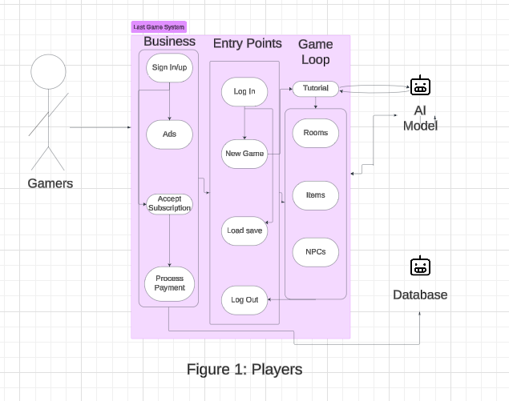
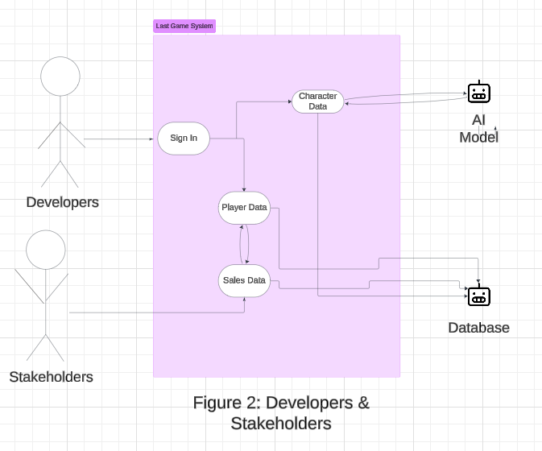

# Requirement Analysis of Last Game
**Developers: NaN**

## Description of the Project:

## Functional Requirements:

### Must-Have:

* Example text
* example text

### Should-Have:

* Example text
* Example text 

### Could-Have
* Example Text
* Example text

### Won't-Have

* Example text
* Example text

## Nonfunctional Requirements:

### Must-Have:

* Example text
* example text

### Should-Have:

* Example text
* Example text 

### Could-Have
* Example Text
* Example text

### Won't-Have

* Example text
* Example text

## Business Requirements:

### Must-Have:

* Example text
* example text

### Should-Have:

* Example text
* Example text 

### Could-Have
* Example Text
* Example text

### Won't-Have

* Example text
* Example text

## User Requirements:

### Must-Have:

* The ability to sign in and sign out of the game with a username and password.
* The user should be able to navigate the game using a combination of the keyboard (especially arrow keys or wasd keys) and the mouse.
* The user should be able to load the game in any browser of their choosing and should be able to refresh the game using the refresh button in the browser.
* Users should be able to save and load their game progress across sessions.*
* A tutorial mode that introduces new players to the game mechanics and features.*
* The ability to pause, resume, or exit the game at any time.*
* The system will allow users to customize difficulty preferences before starting a game.*
* Users will be able to interact with NPCs to receive quests, trade items, and learn about the game's story.*

### Should-Have:

* A pleasing UI that is intuitive to use.
* The ability to customize player characters, including appearance, abilities, and starting equipment.*
* Context-sensitive hints or tips provided by the AI when players seem stuck.*
* Users will be able to collect, equip, and manage items.*

### Could-Have
* Varied brightness settings, FPS settings, and other customizable settings for the user to change depending on their system.
* A feedback system for users to report bugs or suggest improvements.*
* An in-game journal or log that tracks story progression and discovered lore.*
* Easter eggs or hidden secrets that reward exploration or creativity.*
* Users will be able to choose a visual theme (e.g., dark mode, light mode) for the game interface.*
* Users will be able to create multiple save slots to allow for different characters or playthroughs.*
* Users will have the option to skip cutscenes or story elements if they prefer a purely gameplay-focused experience.*

### Won't-Have

* Users able to directly give prompts to the AI to ensure security and proper gameflow.
* Support for multiple languages to reach a global audience.*
* Smooth integration with streaming platforms like Twitch or YouTube for content creators.*
* AI-generated stories saved for replay or export, allowing players to revisit past adventures.*
* Seasonal events or special AI-generated content based on real-world holidays.*
* The ability to share user-created levels or AI-generated dungeon layouts with the community.*
* The system will not allow manual level design by players, as levels will be exclusively generated by the AI.*
* Users will not be able to access the game offline.

## Use-Case Stories:
### Players:
* As a gamer, I want to be able to log in, log out, and save my progress so that I can play my way on my time. 
* As a gamer, I want a settings menu where I can change things like visuals, audio settings, and controls so I have the power to control my experience in the game.
* As a casual gamer, I want to enjoy a low-difficulty, story-driven experience so that I can relax and immerse myself in the game without frustration.
* As a hardcore gamer, I want to challenge myself with progressively difficult enemies and puzzles so that I can test and improve my skills.
* As a speedrunner, I want to access a timer mode and optimized routes so that I can complete the game as quickly as possible and compete with others.
* As a lore enthusiast, I want deep, consistent storylines and interactions with NPCs so that I can immerse myself in the world-building and history of the game.
* As a collector, I want to find rare and unique items scattered throughout the dungeon so that I can complete my in-game collection and unlock hidden rewards.
* As a first-time gamer, I want to have an easy-to-understand tutorial system and simple controls to help me get comfortable with this new world.
* As an accessibiity-focused player, I want this game to be playable to all kinds of people, including those who are hard of hearing or sight or have other mental deficiencies, so that anyone I know can enjoy the game and community.
* As a cooperative player, I want to find in-game companions that I can work together with and build relationships with to solve problems and puzzles I couldn't do alone so I feel like I have friends. 
* As a solo adventurer, I want to feel powerful and important in the story and get crazy gear and items so that I can live out a power-fantasy.
* As a streamer and content creator, I want the game to display exciting actions and dramatic twists in the story to make it easier to keep my audience engaged and therefore make more money. 
* As an achievement hunter, I want to have difficult, niche, and hard-to-find missions to accomplish so I can get unique achievements I can show off to my friends and followers.
* As a modder, I want the game to support third-party software and encourage player-generated content so I can customize the game even more to my liking.
* As a parent playing with my kids, I want the game to stay away from morally questionable topics and teach my kids important lessons about friendship and problem solving so that they can learn while they play.
* As an indie game critic, I want the tutorial to be so ridiculously easy to complete that gamers won't make fun of me online when I struggle.
* As a real indie game critic, I want the game to make me feel intense emotions from the story and characters that provide commentary on real-world problems in society to inspire change in the players of the game. 
* As a stat-focused min-maxer, I want to have skill points I can spend to create mathematically superior characters so I can feel superior to others. 
* As a roleplayer, I want to have access to different character classes and abilities that affect the story so I can build a unique team and feel immersed in the world. 
* As a beta tester, I want to play a fairly polished game that has fun bugs and exploits to find so I can feel like a contributor to the success of the game and get excited for the finished product. 
* As a horror game enthusiast, I want the game to incorporate multiple aspects of horror such as body horror, jumpscares, psychological horror, and others so I can finally feel true fear.
* As a cosplayer, I want the characters in the game to have cute or cool clothing styles and hot bodies so I can dress up as them and impress nerds at Comic-Con. 

### Creators
* As a developer, I want the code to be simple and understandable so I can easily make updates for future content.
* As an AI system engineer, I want access to a properly trained, robust AI model that can handle the demands of the game and continually improve.
* As a front-end developer, I want a dynamic model for the user interface that can adapt to the creations of the AI.
* As a back-end developer, I want a robust database shema that can handle the various creations the AI will produce for the player.

### Stakeholders:
* As an investor, I want the game to show great potential for mass appeal so I can make a huge return on investment. 
* As a sales bro, I want the game to have unique features I can use as evidence for why game stores should stock the product so I can make that fat commission, bro.
* As a member of the marketing team, I want the game to look beautiful and have catchy dialogue or phrases so I can more easily create ads that will cause people to buy. 
* As a data analyst for the game, I want the game to have a simple, secure database structure so I can easily find insights from information we collect from players. 
* As a customer support representative, I want to have clear documentation to reference when things go wrong for players so that I can solve their problems quickly and efficiently. 
* As a game studio executive, I want to include ways to monetize the game so I can improve the bottom line and show great results to the board of directors.  

## Use Case Diagrams:

