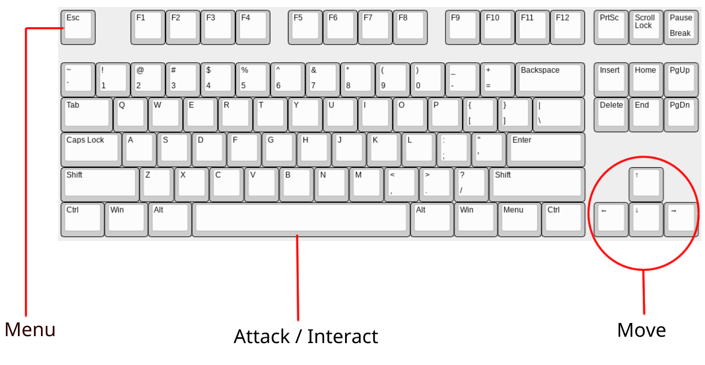

# Use Cases
- Player:
  - Create an account and start a new game
  - Engage in combat against procedurally generated enemies
  - Load a saved game
- Developer
  - Enable developer mode to get unlimited health and damage 


# The Last Game
Welcome to __The Last Game__, an AI-driven turn-based rogue-like!


# Table of Contents
- [Use Cases](#use-cases)
- [The Last Game](#the-last-game)
- [Table of Contents](#table-of-contents)
- [Overview of the Software](#overview-of-the-software)
- [Getting Started](#getting-started)
- [Troubleshooting](#troubleshooting)
  - [The game is taking a long time to load](#the-game-is-taking-a-long-time-to-load)
  - [The game has stopped responding](#the-game-has-stopped-responding)
  - [Stairs are unreachable](#stairs-are-unreachable)
  - [Player starts on a wall](#player-starts-on-a-wall)
  - [A chest spawned in front of the door and I can't get out](#a-chest-spawned-in-front-of-the-door-and-i-cant-get-out)
  - [There is a pop up saying `navigator is not defined`](#there-is-a-pop-up-saying-navigator-is-not-defined)
  - [The screen is stuck on a black screen](#the-screen-is-stuck-on-a-black-screen)
  - [The room generated wrong and I cant progress](#the-room-generated-wrong-and-i-cant-progress)
- [FAQs](#faqs)
  - [Where are the Terms and Conditions?](#where-are-the-terms-and-conditions)
- [Features and Functions](#features-and-functions)
  - [For Players](#for-players)
    - [Creating an account](#creating-an-account)
    - [Sign in](#sign-in)
    - [Starting a new game](#starting-a-new-game)
    - [Loading a Saved Game](#loading-a-saved-game)
    - [Playing the Game](#playing-the-game)
      - [Objective](#objective)
      - [Controls](#controls)
      - [Combat](#combat)
      - [Changing weapons](#changing-weapons)
      - [Changing floors](#changing-floors)
    - [Saving and Exiting the Game](#saving-and-exiting-the-game)
    - [Changing Menu Theme](#changing-menu-theme)
  - [For Moderators](#for-moderators)
    - [Accessing the Docker logs](#accessing-the-docker-logs)
  - [For Developers](#for-developers)
    - [Enabling Developer Mode](#enabling-developer-mode)
- [Installation Instructions](#installation-instructions)
- [Contact Information](#contact-information)


# Overview of the Software 
Our AI-driven video game leverages procedural generation and AI-controlled decision-making to create unique, dynamic gameplay experiences for each player. By incorporating advanced AI, the game will:

- Generate dynamic storylines, dungeons, and interactions based on player choices.
- Utilize AI-driven enemies that adapt to player behavior and tactics.
- Provide real-time difficulty adjustments based on player performance.

This approach ensures a fresh and engaging experience every time a player starts a new session, increasing replayability and engagement.


# Getting Started
**NOTE:** Due to time constraints, we were unable to deploy __The Last Game__, so use the instructions for running it locally!

If you are running __The Last Game__ locally, start with [Installation instructions](#installation-instructions) before continuing.


# Troubleshooting
## The game is taking a long time to load
- Wait 2-3 minutes. If that doesn't work:
- Go back to [http://localhost:3000](http://localhost:3000)
- [Sign in](#sign-in) to your account again and either load a game or start a new game

## The game has stopped responding
- Refresh the page
- Go back to [http://localhost:3000](http://localhost:3000)
- [Sign in](#sign-in) to your account again and either load a game or start a new game

## Stairs are unreachable
This is a known issue with a fix planned in a future update. To fix this [start a new game](#starting-a-new-game)

## Player starts on a wall
Move towards a floor tile to get unstuck. If no floor tiles are reachable within 1 space, you may need to [start a new game](#starting-a-new-game)

## A chest spawned in front of the door and I can't get out
- This is a known issue that is planned to be fixed in a future update
- Exit the game and [start a new game](#starting-a-new-game)

## There is a pop up saying `navigator is not defined`
1. First try refreshing the page
2. If that doesn't work navigate back to [http://localhost:3000](http://localhost:3000) and [sign in](#sign-in) again

## The screen is stuck on a black screen
- refresh the page
- If that doesn't work, [load your game](#loading-a-saved-game) or [start a new game](#starting-a-new-game)

## The room generated wrong and I cant progress
- This is a known issue that is planned to be fixed in a future update
- Exit the game and [start a new game](#starting-a-new-game) 


# FAQs 

## Where are the Terms and Conditions?
- They are planned in a future update


# Features and Functions 

## For Players 
First, navigate to [http://localhost:3000](http://localhost:3000) to access the game. To play, you will need to either [create an account](#creating-an-account) or [sign in](#sign-in).

### Creating an account
From the login screen, click the `create account` button at the bottom of the screen.


[_Login page_]

Fill out the following fields:
- `Username`
- `Email`
- `Password`
- `Confirm Password`

Note that the `password` must be 6 characters or more and the `confirm password` should match what is in the `password` field.
Finally, check the box next to `Accept terms & conditions` and click `create account` to create your account.

### Sign in
1. Enter your username and password in the appropriate fields
2. (Optional) click `remember me`
3. Click the `LOGIN` button

You will be redirected to a page that give you an option to [start a new game](#starting-a-new-game)  

### Starting a new game
After logging in, you will be taken to the menu screen with two buttons that say `start game` and `load game`. Clicking the `start game` button will bring you to to a screen that explains the game. Click `next` in the bottom right to continue.

You will then be given a couple of options for your game:
- Theme - this affects the aesthetic of the map
- Difficulty - this affects the overall stats of the enemies

After selecting your options, the AI will generate a story, floor, enemies, and weapons. While this process is usually quick, there are some cases where it may take a long time. See the [Troubleshooting](#troubleshooting) section for more details if you encounter this.


### Loading a Saved Game
Navigate to the game menu where there are two buttons saying `start game` and `load game`. If you are unsure how to get there, navigate back to [localhost:3000](http://localhost:3000) and [log in](#sign-in) to your account. From this menu:
1. Select `load game`
2. Select which game you want to load

### Playing the Game

#### Objective
The goal of __The Last Game__ is to reach the highest floor that you can without loosing all of your health. To do this you will need to fight enemies, upgrade your weapons, and locate the stairs to progress.

#### Controls


[_Controls_]

- Use the **Arrow keys** to move your character.
- Press **Space** when facing an enemy to attack. This only works if the enemy is within range of your current weapon.
- Press **Escape** to bring up the menu.

#### Combat


[_Combat range_]

- Press `space` to attack in the direction you are facing
  - Attacking enemies reduces their health by the attack value associated with your current weapon
- You can only attack directly to the side, above, or below your current position
- If your health reaches 0, it is game over

#### Changing weapons


[_Example Chest_]

To change weapons, you first need to find a chest that contains a weapon. 
**Chests only appear if the room has been cleared of enemies.**

- Press `Space bar` to open the chest. You will then be presented with a menu that looks like the following:


[_Chest Menu_]

You will see the weapon in the chest as well as your current weapon. You will be able to see the damage of each weapon as well. Do one of the following:

- Click `Swap Weapons` (Option 1) to change your current weapon
- Click `Leave Weapon` (Option 2) to keep your current weapon

#### Changing floors

Stepping on a stair tile will allow you to move to the next room. **Note** that once you move to the next floor via the stairs you will not be able to return and the game will become more difficult.


[_Stair Tile_]


### Saving and Exiting the Game
- Press `esc` to bring up the menu
- Click on `Save Game` to save the game and continue playing (Option 1 in the picture below)
- Click on `Exit and Save` to save the game and then quit (Option 2 in the picture below)


### Changing Menu Theme


[_Settings menu_]

- Click the settings menu in the top right corner
- Click `Toggle Dark Mode`
- Click `Save Changes`


## For Moderators

### Accessing the Docker logs
1. Navigate to the folder where the Last Game is in your terminal
2. run `docker-compose logs -f backend` to view the logs for the backend
    - Replace `backend` with either `frontend` or `db` to get the logs for those Docker containers
3. Press `Ctrl + c` to stop viewing the logs for the container.


## For Developers

### Enabling Developer Mode
1. Start a game like normal and continue until reaching the difficulty selection
2. Enter the Konami code:
  a. up
  b. up
  c. down
  d. down
  e. left
  f. right
  g. left
  h. right
  i. b
  j. a
3. Open the dev console to confirm that developer mode is activated


# Installation Instructions 
You will need to create a `.env` file and place it in the root directory of The Last Game. The `.env` file should have the following fields: 
```.env
API_KEY=<YOUR-API-KEY>
DATABASE_URL=postgres://user:password@db:5473/game
POSTGRES_USER=kgardner
POSTGRES_PASSWORD=kwit2323!
POSTGRES_DB=game_db
ACCESS_TOKEN_SECRET=asdf
REFRESH_TOKEN_SECRET=asdf
DB_HOST=game_db
DB_USER=kgardner
DB_PASSWORD=kwit2323!
DB_NAME=game_db
DB_PORT=5432
DB_SSLMODE=disable
DB_TIMEZONE=UTC
```
The `API_KEY` can be acquired by going to [Groq's](https://console.groq.com/home?utm_source=website&utm_medium=outbound_link&utm_campaign=dev_console_click) website and creating a free account. After you have created an account, create a new API key and replace the <YOUR-API-KEY> with your API key.

See the [DOCKER_README](../DOCKER_README.md) for instructions on how to install and run the game.


# Contact Information 
- Jacob Bartholomew
- Ethan Bates
- Jaxton Esplin
- Gabe Freeman
- Kelson Gardner
- Kevin Shaffer